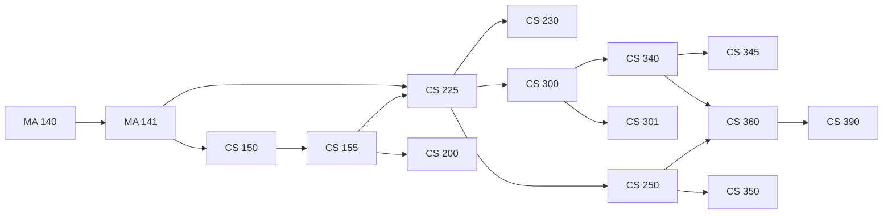

# 拓扑排序应用软件（Topological Sort Application）

---

## 项目信息

-课程信息：课程名称、课程代码 `CST4823A 高级算法原理实践`
-项目名称：拓扑排序应用软件
-指导教师：廖海泳，陈银冬
-组别信息：第六组
          2024611026骆深敏  任务A
          2024611209易雨杰  任务B
          2024611180戴燕岚  任务C
          2024611022黄佳慧  任务D
          2024611020吴丽梅  任务E

## 功能特性

本系统是基于 Java‑Swing 开发的课程拓扑排序桌面应用软件，实现有向图数据编辑、拓扑排序计算、关系图可视化、结果导出等完整功能。

软件界面划分为菜单栏、工具栏、输入编辑区、关系图画布、拓扑结果面板以及底部状态栏。输入模块支持文本`<起点,终点>`格式与表格两种编辑方式，支持二者双向同步，可加载、保存 txt 格式关系数据，能够识别注释、全角符号，对非法输入定位错误行号并弹窗提示。

计算模块采用后台子线程执行运算，避免界面卡顿，支持中途取消计算。集成 Kahn 拓扑排序、DFS 回溯多序列枚举、环路径检测算法；设置结果数量上限与超时保护，防止大图运算过载。若检测到环路，将在画布高亮环路径并弹窗展示环信息；无环时枚举全部合法拓扑序列。

可视化模块提供分层、环形两种布局，支持画布缩放、平移、手动拖拽调整节点位置，双击节点可查看节点入度、出度、先修与后继信息；选中拓扑序列时，画布同步高亮对应节点与边并显示序列序号徽章。拓扑结果采用分页展示，支持单条序列复制。

系统具备完善导出能力，可将拓扑结果导出为 TXT、CSV 文件（记录结果完整性与计算停止原因），也可将带图例的关系图导出为 PNG 图片。底部状态栏实时显示节点、边、环状态、序列数量与计算耗时。同时提供命令行测试入口，无需启动 GUI 即可完成解析与算法校验，软件对空图、孤立节点、自环、非法输入等边界场景均做了容错处理，保证程序稳定不崩溃。

## 技术栈

| 项 | 选择 |
|----|------|
| 开发语言 | Java 8+；**开发环境JDK21，兼容运行JDK8及以上** |
| GUI框架 | Swing（JDK内置组件，零第三方外部依赖；桌面客户端，**非网页程序，满足任务书硬性约束**） |
| 编译构建方式 | javac 命令行编译 / IDEA/Eclipse 直接编译；支持打包生成可执行Jar包；提供bat批处理脚本一键启动 |
| 持久化数据格式 | 纯文本文件`.txt`，统一关系格式`<a,b>`；排序结果支持导出txt / csv，满足任务书文本存储要求 |
| 版本管理工具 | Git + GitHub私有仓库；分支策略：main主干 + 成员独立开发分支(dev‑a/dev‑b/dev‑c/dev‑d/dev‑e)，禁止直接在main分支开发 |
| 测试方案 | 自定义单元测试代码；配套`run_tests.bat`冒烟一键测试脚本；独立命令行入口`AlgorithmRunner`，无GUI可完成算法测试 |
| 项目文档工具 | Word（doc）+ PDF输出；Markdown用于接口契约、代码规范等开发文档 |
| 系统平台兼容性 | Windows / Linux / macOS 跨平台运行；验收推荐Windows环境测试 |

> ### 技术约束说明（来自课程任务书）
> 1. 本项目为**桌面GUI应用软件，禁止网页实现**；
> 2. 业务数据全部使用文本文件存储，不使用数据库；
> 3. 尽量采用面向对象思想完成软件设计与编码。

> ### 关键注意点
> 1. 编译运行必须增加参数 `-encoding UTF‑8`，防止中文注释、课程节点名称乱码；导出PNG图片需要处理中文字体渲染；
> 2. 最低运行环境为 JDK 8，本机使用JDK21开发，提交交付物向下兼容；
> 3. 无任何第三方依赖库，全部使用JDK标准类库，验收机器无需额外安装组件。

## 核心算法

1. **Kahn**：入度队列，O(V+E)，输出一种拓扑排序；
2. **枚举全部**：DFS + 回溯，统计总数，支持输出上限（默认 1000）；
3. **环检测与环路径定位**：Kahn 计数 + DFS 三色标记，输出环路径。

## 目录结构

```
topological-sort/
├── README.md                  # 本文件
├── .gitignore
├── run_tests.bat              # 冒烟自动化测试脚本
├── docs/                      # docs目录下存放Java+Swing课程拓扑排序桌面软件全套设计、接口、测试与协作文档
├── data/                      # figure1.txt（15 门课程）、curriculum.txt（全系 ≥30 节点）
├── src/
│   ├── model/                 # Vertex / Edge / Graph
│   ├── algorithm/             # Kahn / 枚举 / 环检测
│   ├── io/                    # DataParser / FileManager / ParseIssue / ParseResult / ImageExporter
│   ├── view/                  # GraphPanel（静态环形画布），LayoutManager（分层布局）
│   ├── ui/                    # MainFrame / InputPanel / ResultPanel / MainController / StatusBar
│   ├── util/                  # UIStyle / ExceptionHandler / InputValidator
|   └── AlgorithmRunner.java   # 无 GUI 的命令行独立测试入口
├── test/                      # 算法测试（四类用例）代码 / 解析器测试代码 / 自测代码 / txt测试报告
├── 会议记录/                   # 五个会议记录（doc + pdf）
├── 拓扑排序项目-团队任务执行方案 # 分工细节
└── screenshots/               # 运行截图
```

## 成员分工（5 人 × 8 项任务）

| 角色 | 负责模块 | 核心任务 |
|------|---------|---------|
| 组长 B（易雨杰） | GUI 主框架 + 交互控制 + 项目统筹 | 主窗口、输入/结果面板、主流程控制、状态栏异常、需求分析、详细设计 GUI、界面美化 + 整体协调 |
| 组员 A（骆深敏） | 架构 + 核心算法 + 文档统筹 | 图结构、Kahn、枚举、环检测、接口契约、Git、可行性分析、概要设计 + 报告统筹 |
| 组员 C（戴燕岚） | 关系图可视化 + 图片导出 | 绘制组件、分层/环形布局、缩放拖拽、PNG 导出、详细设计可视化、截图整理 |
| 组员 D（黄佳慧） | 数据文件 + 导入导出 + 异常 | 解析器、文件读写、输入校验、异常场景清单、两组数据、测试报告、用户手册 |
| 组员 E（吴丽梅） | 测试 + 工程交付 | 算法/解析测试、冒烟脚本、命令行入口、会议记录、readme、打包、提交核对 |

> 汇报类工作（中期演示、现场答辩、视频录制）由组长另行安排，不计入任务分配。

## 里程碑

| 日期 | 节点 |
|------|------|
| 09-17 | 接口冻结（V1.0 已合入 main，PR #3） |
| 09-20 | MVP：命令行跑通图 1（建图 → 排序 → 环检测） |
| 09-21 | 中期验收（40%） |
| 09-23 | 功能冻结 |
| 09-27 | 材料齐 + 打包 groupXX.zip |
| 09-28 | 现场验收（60%） |

## 开工准备

```
# 1. 检查环境（JDK 8+、Git）
java -version
git --version

# 2. 首次配置 Git 身份
git config --global user.name "你的姓名"
git config --global user.email "你的邮箱"

# 3. 克隆并切到自己的分支（A/C/D/E 对应 dev-a/dev-c/dev-d/dev-e）
git clone <仓库地址>
cd topo-sort-app
git checkout -b dev-b origin/dev-b

# 4. 验证
git branch          # 应显示 * dev-b
```

> 注意：禁止在 main 上直接开发；切错分支用 `git checkout <分支名>` 纠正。

## 开发工作流与完成定义

```
① 认领任务 → ② 切分支（dev-x） → ③ 开发（遵守 docs/代码规范.md、接口按 docs/接口契约.md）
④ 自测（javac 编译通过 + 按验收标准验证） → ⑤ git commit -m "【任务编号】说明"
⑥ git push origin dev-x → ⑦ 发起合并请求（dev-x → main） → ⑧ 组长 Review → ⑨ 合入 main
```

**完成定义（DoD）**：可编译可运行；达到任务卡验收标准；commit 含【任务编号】；合并请求已合入 main。

**卡点升级**：任务被卡超过半天，群里说明并 @组长，当天协调解决。

## 开发规范

1. 分支：main 为稳定主干，每人一条开发分支（dev-xxx，命名 9.17 统一），禁止直接 push main；
2. 提交格式：`【任务编号】说明`；
3. 接口契约 9.17 冻结，冻结后变更需组长审批；
4. 代码规范（命名 / 注释 / 异常中文提示）见 `docs/代码规范.md`；
5. 每日站会 21:00 群内同步（昨天完成 / 今天计划 / 卡点 / 需要谁配合）。

## 数据格式

每行一条关系，西文尖括号：`<a,b>` 表示 a 是 b 的前驱（存在有向边 a → b）。
空行忽略；`#` 开头为注释；自动去除重复边；自环单独标记。

```
# 示例（任务书图 1 节选）
<CS 150,CS 155>
<CS 155,CS 200>
<CS 155,CS 225>
<CS 200,CS 225>
```

## 关系图预览

`data/figure1.txt`（任务书图 1：15 门课程、16 条先修关系）。下图为 Mermaid 有向图，在 GitHub 上直接渲染，节点是课程、箭头方向为先修 → 后修；由数据文件逐条生成：



完整的 43 节点 / 85 边培养方案关系图见 [需求分析报告](docs/需求分析报告.md#53-数据文件示例) 5.3 节。

## 编译与运行

### 编译src和test到out文件夹中
$outDir=".\out"
if(Test-Path $outDir){Remove-Item -Recurse -Force $outDir}
New-Item -ItemType Directory -Path $outDir | Out-Null
$src=Get-ChildItem src -Recurse -Filter *.java|Where-Object{$_.Name -ne "package-info.java"}
$test=Get-ChildItem test -Recurse -Filter *.java|Where-Object{$_.Name -ne "package-info.java"}
javac -encoding UTF-8 -d $outDir @($src.FullName+$test.FullName)
### 运行GUI
java -cp out ui.MainFrame
### 命令行无GUI工具
java -cp out AlgorithmRunner data/figure1.txt
### 算法测试
java -cp out test.AlgorithmTest
### 解析容错测试
java -cp out test.ParserFaultTest
### run_tests.bat
双击 run_tests.bat，脚本自动完成：清理旧编译产物 → 全部源码编译 → 执行全套测试
