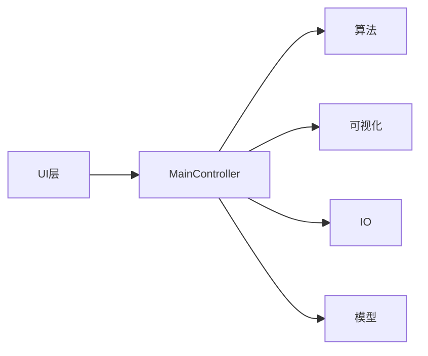
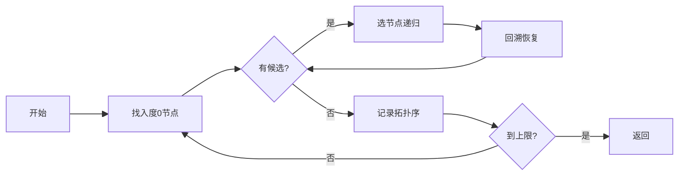

# 拓扑排序应用软件（Topological Sort Application）

> 高级算法原理实践课程项目 · 基于 Java Swing 的有向图拓扑排序枚举与可视化工具

---

## 项目简介

本项目是高级算法原理实践课程的小组作业，实现了一个基于图形界面的拓扑排序工具。用户输入课程先修关系后，系统自动解析构建有向无环图，枚举所有合法的拓扑排序结果，并以可视化方式展示图结构、高亮环路径、联动查看每条拓扑序的执行顺序。

核心目标：不仅输出单条拓扑排序，而是**枚举所有可能的拓扑排序结果**，并支持大图下的上限、超时、取消保护机制，防止大结果集导致程序无响应。

---

## 核心功能

| 功能模块 | 详细说明 |
|---------|---------|
| 关系输入 | 支持文本框直接粘贴、TXT文件导入、表格编辑三种方式，自动过滤空行 |
| 自动建图 | 解析 `<a,b>` 格式关系，自动去重、识别自环、非法行号定位提示 |
| 拓扑排序枚举 | 集成 Kahn 算法 + DFS 回溯全枚举，默认上限1000条结果 |
| 环检测 | 自动检测环并红色高亮环路径，状态栏同步提示环信息 |
| 可视化画布 | 分层/环形双布局，支持滚轮缩放、拖拽平移、节点位置拖动 |
| 结果联动 | 点击结果列表，画布同步高亮对应拓扑序路径，节点标注顺序序号 |
| 多格式导出 | 支持 TXT/CSV 排序结果导出、PNG 关系图导出，记录结果完整性 |
| 稳定保护 | 30秒超时、计算过程可中途取消，大图运算不卡死 |

---

## 技术栈

| 项 | 说明 |
|----|------|
| 开发语言 | Java（JDK 21 开发，兼容 JDK 8+） |
| GUI 框架 | Java Swing（零第三方依赖，JDK 内置） |
| 数据存储 | 纯文本文件 `.txt`，无数据库，满足任务书要求 |
| 版本管理 | Git + GitHub，分支开发，代码评审合并 |
| 运行平台 | Windows / Linux / macOS 跨平台 |

---

## 系统架构



---

## 核心算法说明

### 1. Kahn 拓扑排序
基于入度队列的经典算法，时间复杂度 O(V+E)，每次选取入度为 0 的节点加入结果，更新后继节点入度，直到队列为空，输出单条拓扑序列。

### 2. 全拓扑排序枚举
基于 DFS + 回溯实现全量枚举：
- 每一步在当前入度为 0 的候选节点中选择一个
- 递归深入，将该节点加入结果，更新邻接节点入度
- 递归返回后回溯，恢复入度状态，尝试下一个候选节点
- 默认上限 1000 条，防止大图结果爆炸



### 3. 环检测与环路径定位
- Kahn 计数法判定：出队节点数 < 总节点数则存在环
- DFS 三色标记法定位具体环路径，例如 `A → B → C → A`
- 检测到环时画布红色高亮，状态栏同步提示

---

## 项目结构

```
src/
├── model/          # 图数据结构（Vertex/Edge/Graph）
├── algorithm/      # 核心算法（Kahn/全枚举/环检测）
├── io/             # 输入输出（解析/文件读写/导出）
├── view/           # 可视化组件（GraphPanel/布局管理器）
├── ui/             # GUI界面（主窗口/输入面板/结果面板/控制器）
├── util/           # 工具类（UI样式/异常处理/输入校验）
└── AlgorithmRunner.java  # 命令行测试入口
data/              # 测试数据（figure1.txt/curriculum.txt）
docs/              # 设计文档/接口契约/测试记录
test/              # 单元测试代码
```

---

## 成员分工

| 成员 | 学号 | 负责模块 |
|------|------|---------|
| 易雨杰 | 2024611209 | GUI 主框架 + 交互控制 + 项目统筹 |
| 骆深敏 | 2024611026 | 架构设计 + 核心算法 + 文档统筹 |
| 戴燕岚 | 2024611180 | 关系图可视化 + 图片导出 |
| 黄佳慧 | 2024611022 | 数据解析 + 导入导出 + 异常处理 |
| 吴丽梅 | 2024611020 | 测试 + 工程交付 + 汇报材料 |

---

## 快速开始

### 环境要求
- JDK 8 或以上版本
- Git

### 编译运行（Windows PowerShell）

```powershell
# 克隆仓库
git clone https://github.com/yyj138/topological-sort.git
cd topological-sort

# 编译全部源码
javac -encoding UTF-8 -d out (Get-ChildItem -Recurse -Filter *.java src | where name -ne package-info).FullName

# 启动图形界面
java -cp out ui.MainFrame

# 命令行测试（无需GUI）
java -cp out AlgorithmRunner data/figure1.txt
```

---

## 数据格式说明

每行一条关系，西文尖括号格式：`<先修课程,后续课程>`，表示存在一条从先修到后续的有向边。

```
# 示例
<MA 140, MA 141>
<MA 141, CS 150>
<CS 150, CS 155>
```

- 空行自动忽略
- `#` 开头为注释行
- 重复边自动去重
- 自环单独标记

---

## 项目里程碑

| 日期 | 阶段 | 状态 |
|------|------|------|
| 09-17 | 接口冻结，模块开发启动 | 已完成 |
| 09-20 | 核心功能跑通，MVP版本完成 | 已完成 |
| 09-22 | 中期汇报演示 | 进行中 |
| 09-23 | 功能冻结，进入测试阶段 | 待开始 |
| 09-28 | 最终验收交付 | 待开始 |
