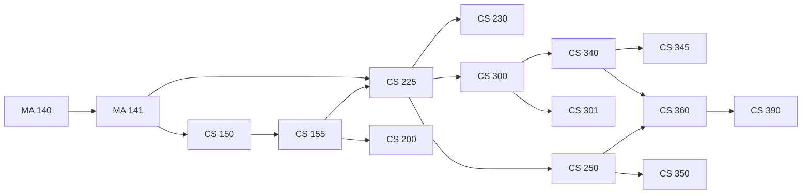

# 拓扑排序应用软件（Topological Sort Application）

---

## 功能特性

- 图形界面输入（文本粘贴 + 表格编辑），实时绘制关系图
- Kahn 拓扑排序 + DFS 回溯枚举全部结果（默认上限 1000 条，可切换全部）
- 环检测并定位环路径（如 A→B→C→A），界面高亮
- 数据导入导出（txt/csv）、关系图导出 PNG（中文不乱码）
- 分层 / 环形布局切换，缩放、平移、拖拽，右键单节点高亮，状态栏实时显示缩放比例
- 异常容错：非法输入定位到行号，重复边去重，自环标记

## 技术栈

| 项 | 选择 |
|----|------|
| 语言 | Java 8+（当前开发环境 JDK 21） |
| GUI | Swing（JDK 自带，零外部依赖） |
| 构建 | javac / IDE 直接编译 |
| 数据 | 文本文件（.txt），统一 `<a,b>` 格式 |
| 版本管理 | GitHub + Git 分支协作 |

## 核心算法

1. **Kahn**：入度队列，O(V+E)，输出一种拓扑排序；
2. **枚举全部**：DFS + 回溯，统计总数，支持输出上限（默认 1000）；
3. **环检测**：Kahn 计数 + DFS 三色标记，输出环路径。

## 目录结构

```
topo-sort-app/
├── README.md                  # 本文件
├── .gitignore
├── docs/                      # 接口契约.md（V1.0 已冻结）、代码规范.md、设计/图数据结构设计.md
├── data/                      # figure1.txt（15 门课程）、curriculum.txt（全系 ≥30 节点）
├── src/
│   ├── model/                 # Vertex / Edge / Graph
│   ├── algorithm/             # Kahn / 枚举 / 环检测
│   ├── io/                    # DataParser / FileManager（组员 D 正式实现）
│   ├── view/                  # GraphPanel（静态环形画布，C 后续演进分层布局）
│   ├── ui/                    # MainFrame / InputPanel / ResultPanel / MainController / StatusBar
│   └── util/                  # UIStyle / ExceptionHandler / InputValidator
├── test/                      # 算法 / 解析测试（根目录，T-E1/E2）
└── screenshots/               # 运行截图
```

## 成员分工（5 人 × 8 项任务）

| 角色 | 负责模块 | 核心任务 |
|------|---------|---------|
| 组长 B（yyj138） | GUI 主框架 + 交互控制 + 项目统筹 | 主窗口、输入/结果面板、主流程控制、状态栏异常、需求分析、详细设计 GUI、界面美化 + 整体协调 |
| 组员 A（Mynth116） | 架构 + 核心算法 + 文档统筹 | 图结构、Kahn、枚举、环检测、接口契约、Git、可行性分析、概要设计 + 报告统筹 |
| 组员 C（____） | 关系图可视化 + 图片导出 | 绘制组件、分层/环形布局、缩放拖拽、PNG 导出、详细设计可视化、截图整理 |
| 组员 D（____） | 数据文件 + 导入导出 + 异常 | 解析器、文件读写、输入校验、异常场景清单、两组数据、测试报告、用户手册 |
| 组员 E（____） | 测试 + 工程交付 | 算法/解析测试、冒烟脚本、命令行入口、会议记录、readme、打包、提交核对 |

> 汇报类工作（中期演示、现场答辩、视频录制）由组长另行安排，不计入任务分配。

## 里程碑

| 日期 | 节点 |
|------|------|
| 09-17 | 接口冻结（V1.0 已合入 main，PR #3） |
| 09-20 | MVP：命令行跑通图 1（建图 → 排序 → 环检测） |
| 09-21 | 中期验收（40%） |
| 09-23 | 功能冻结 |
| 09-27 | 材料齐 + 打包 groupXX.zip |
| 09-28 | 现场验收（60%） |

## 开工准备

```
# 1. 检查环境（JDK 8+、Git）
java -version
git --version

# 2. 首次配置 Git 身份
git config --global user.name "你的姓名"
git config --global user.email "你的邮箱"

# 3. 克隆并切到自己的分支（A/C/D/E 对应 dev-a/dev-c/dev-d/dev-e）
git clone <仓库地址>
cd topo-sort-app
git checkout -b dev-b origin/dev-b

# 4. 验证
git branch          # 应显示 * dev-b
```

> 注意：禁止在 main 上直接开发；切错分支用 `git checkout <分支名>` 纠正。

## 开发工作流与完成定义

```
① 认领任务 → ② 切分支（dev-x） → ③ 开发（遵守 docs/代码规范.md、接口按 docs/接口契约.md）
④ 自测（javac 编译通过 + 按验收标准验证） → ⑤ git commit -m "【任务编号】说明"
⑥ git push origin dev-x → ⑦ 发起合并请求（dev-x → main） → ⑧ 组长 Review → ⑨ 合入 main
```

**完成定义（DoD）**：可编译可运行；达到任务卡验收标准；commit 含【任务编号】；合并请求已合入 main。

**卡点升级**：任务被卡超过半天，群里说明并 @组长，当天协调解决。

## 开发规范

1. 分支：main 为稳定主干，每人一条开发分支（dev-xxx，命名 9.17 统一），禁止直接 push main；
2. 提交格式：`【任务编号】说明`；
3. 接口契约 9.17 冻结，冻结后变更需组长审批；
4. 代码规范（命名 / 注释 / 异常中文提示）见 `docs/代码规范.md`；
5. 每日站会 21:00 群内同步（昨天完成 / 今天计划 / 卡点 / 需要谁配合）。

## 数据格式

每行一条关系，西文尖括号：`<a,b>` 表示 a 是 b 的前驱（存在有向边 a → b）。
空行忽略；`#` 开头为注释；自动去除重复边；自环单独标记。

```
# 示例（任务书图 1 节选）
<CS150,CS155>
<CS155,CS200>
<CS155,CS225>
<CS200,CS225>
```

## 关系图预览

`data/figure1.txt`（任务书图 1：15 门课程、16 条先修关系）。下图为 Mermaid 有向图，在 GitHub 上直接渲染，节点是课程、箭头方向为先修 → 后修；由数据文件逐条生成：



完整的 43 节点 / 85 边培养方案关系图见 [需求分析报告](docs/需求分析报告.md#53-数据文件示例) 5.3 节。

## 编译与运行

```powershell
# Windows PowerShell：递归编译，必须显式指定 UTF-8
Set-Location src
$files = (Get-ChildItem -Recurse -Filter "*.java" |
          Where-Object { $_.Name -ne "package-info.java" }).FullName
& javac @('-encoding','UTF-8','-d','out') @files

Set-Location out
java ui.MainFrame
```
