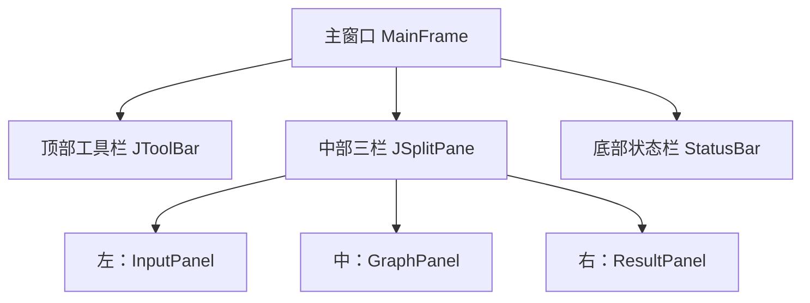

# B1 主窗口与布局验证记录

## 验证目标
验证MainFrame主窗口三栏布局是否正确，组件是否正常显示，窗口缩放是否自适应。

## 测试环境
- JDK 21.0.6
- Windows 11
- Swing 默认外观

## 验证步骤与结果

| 步骤 | 操作 | 预期结果 | 实际结果 |
|------|------|----------|----------|
| 1 | 启动程序 | 窗口默认大小1280×720，标题显示"拓扑排序工具" | 符合预期 |
| 2 | 查看整体布局 | 顶部工具栏、中部三栏、底部状态栏 | 符合预期 |
| 3 | 拖拽中间分割条 | 三栏宽度可以调整，比例实时变化 | 符合预期 |
| 4 | 缩小窗口到最小800×600 | 不出现组件重叠，内容自动出滚动条 | 符合预期 |
| 5 | 放大窗口 | 三栏自动适配新尺寸 | 符合预期 |

## 布局结构

## 结论
主窗口布局正常，三栏分割和窗口缩放功能符合设计要求。
