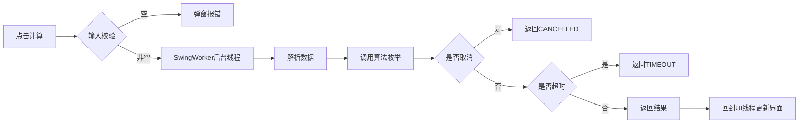

# B2 控制器与后台任务验证记录

## 验证目标
验证MainController调度逻辑，确认计算过程在后台线程执行，不阻塞UI，取消功能正常。

## 测试环境
- JDK 21.0.6
- curriculum.txt 测试数据
- 枚举上限1000条，超时30秒

## 验证步骤与结果

| 步骤 | 操作 | 预期结果 | 实际结果 |
|------|------|----------|----------|
| 1 | 空输入点计算 | 弹窗提示"请输入关系数据" | 符合预期 |
| 2 | 正常输入点计算 | 计算时按钮变灰，UI仍可拖动窗口 | 符合预期 |
| 3 | 计算过程中点取消 | 任务中断，状态栏显示"用户取消" | 符合预期 |
| 4 | 小数据点计算 | 快速完成，结果正常显示 | 符合预期 |
| 5 | 大数据枚举时UI拖动 | 窗口可以正常拖动，不卡顿 | 符合预期 |

## 计算调度流程

## 结论
后台调度正常，计算过程不阻塞UI，取消和超时机制符合设计要求。
