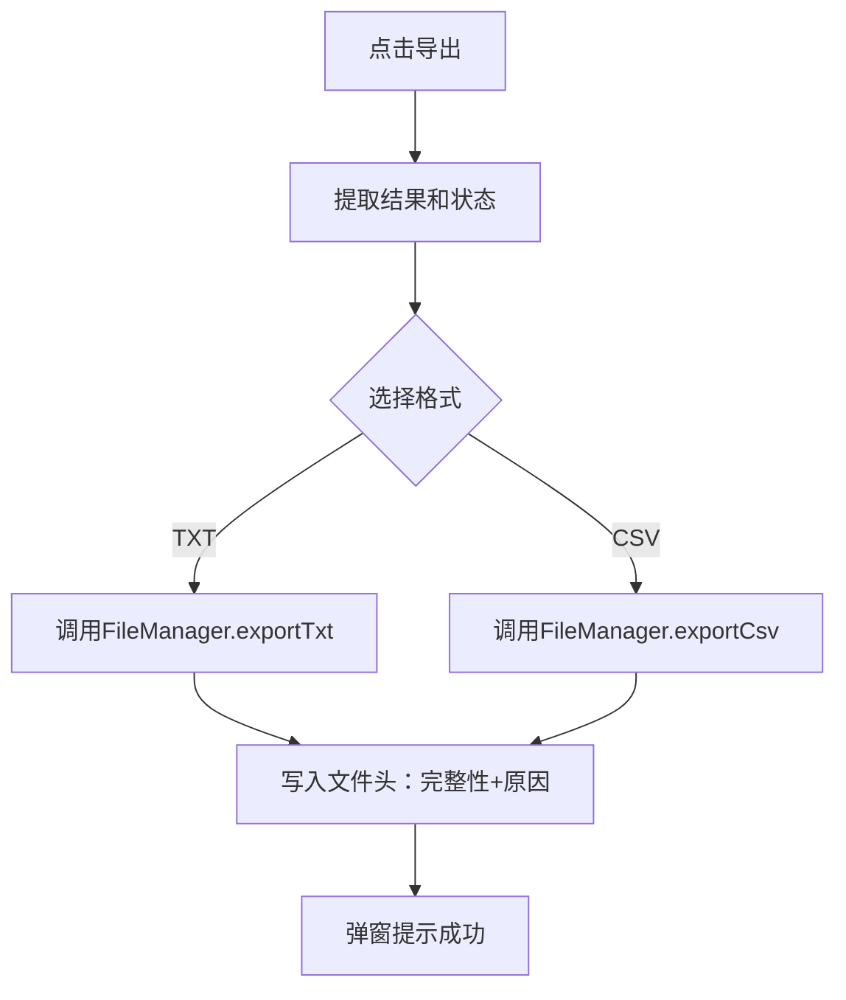

# B4 导出与异常处理验证记录

## 验证目标
验证导出TXT/CSV功能，文件头写入完整性信息，统一异常弹窗正常。

## 测试环境
- JDK 21.0.6
- 测试数据curriculum.txt

## 验证步骤与结果

| 步骤 | 操作 | 预期结果 | 实际结果 |
|------|------|----------|----------|
| 1 | 完整结果点导出TXT | 文件头写"结果完整，共X条" | 符合预期 |
| 2 | 达到上限时导出 | 文件头写"达到上限1000条" | 符合预期 |
| 3 | 用户取消后导出 | 文件头写"用户取消，已生成X条" | 符合预期 |
| 4 | 导出CSV | 格式正确，序号列正常 | 符合预期 |
| 5 | 输入格式错误点计算 | 弹窗提示第X行格式错误 | 符合预期 |
| 6 | 导出到只读路径 | 弹窗提示导出失败 | 符合预期 |

## 导出流程

## 结论
导出功能正常，文件头完整性信息写入正确，异常弹窗提示清晰，符合接口契约要求。
