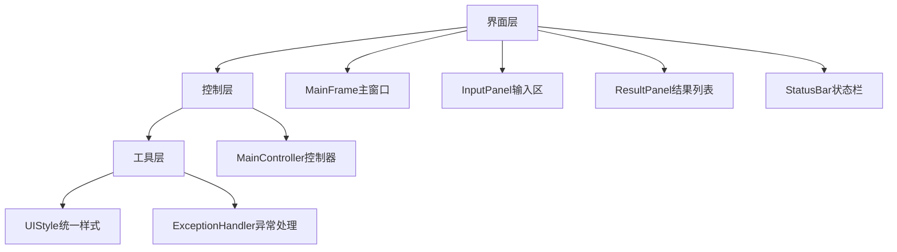
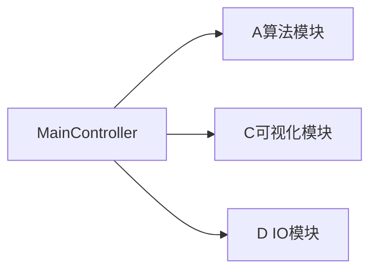

# GUI与控制模块概要设计

## 一、整体架构
模块采用视图与控制器分离设计，分为三层：

```mermaid
flowchart TD
    A[界面层] --> B[控制层] --> C[工具层]
    A --> A1[MainFrame主窗口]
    A --> A2[InputPanel输入区]
    A --> A3[ResultPanel结果列表]
    A --> A4[StatusBar状态栏]
    B --> B1[MainController控制器]
    C --> C1[UIStyle统一样式]
    C --> C2[ExceptionHandler异常处理]
```

## 二、模块关系
本模块向下对接三个其他模块：

```mermaid
flowchart LR
    A[MainController] --> B[A算法模块]
    A --> C[C可视化模块]
    A --> D[D IO模块]
```

- 对接A：接收EnumerationResult，获取结果列表、完整性、停止原因
- 对接C：传入Graph绘制关系图，传入选中序列高亮路径
- 对接D：调用DataParser解析输入，调用FileManager导出文件
