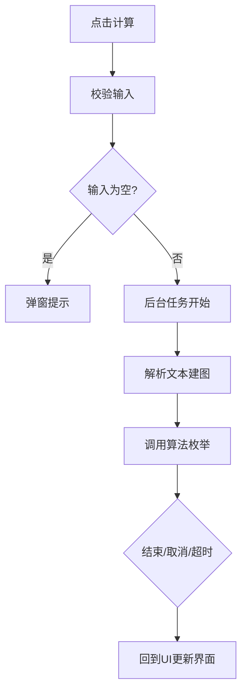
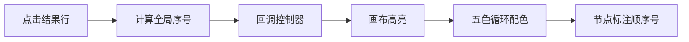
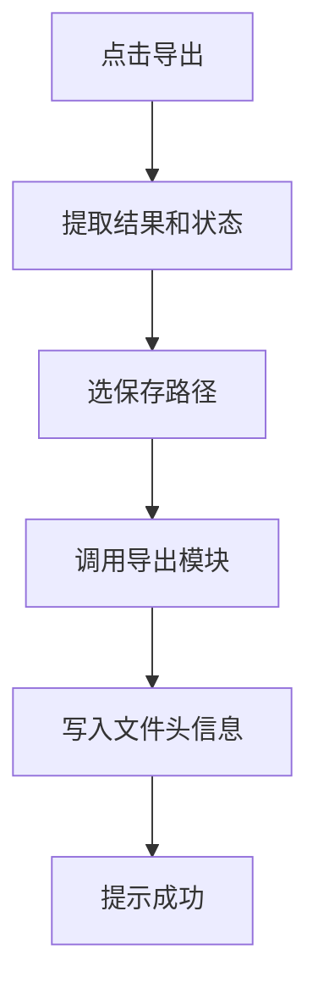

# GUI与控制模块详细设计

## 一、类设计

| 类名 | 所在包 | 职责 |
|------|--------|------|
| MainFrame | ui | 主窗口，三栏布局，程序入口 |
| MainController | ui | 主控制器，调度后台任务，对接其他模块 |
| InputPanel | ui | 左侧输入面板，文本编辑和按钮 |
| ResultPanel | ui | 右侧结果面板，分页显示和选中回调 |
| StatusBar | ui | 底部状态栏，显示统计信息 |
| UIStyle | util | 统一样式，管理配色和按钮 |
| ExceptionHandler | util | 统一异常弹窗 |

## 二、核心流程

### 计算流程

### 结果选中联动流程

### 导出流程

## 三、交互设计
- 主窗口三栏布局，顶部工具栏，底部状态栏
- 结果每页20条，双击复制条目
- 所有错误统一弹窗，带行号
