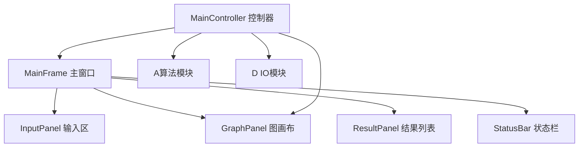
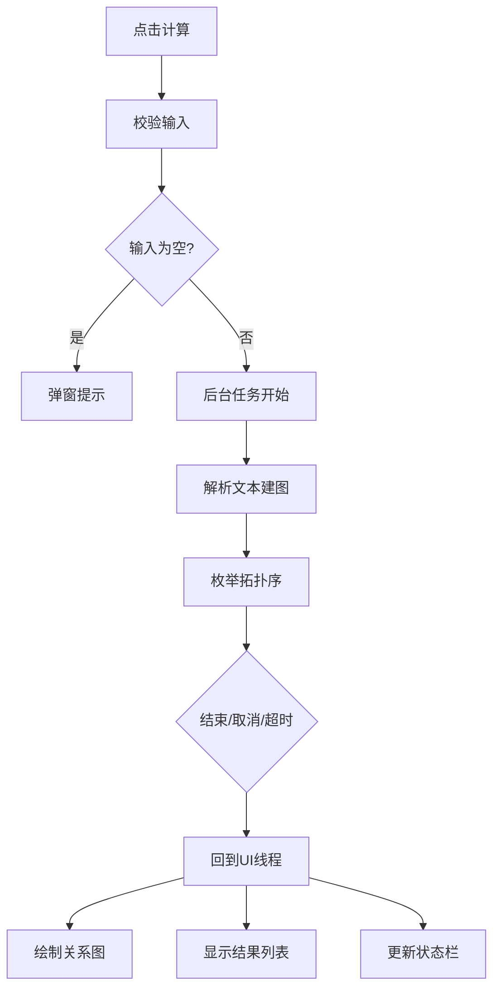
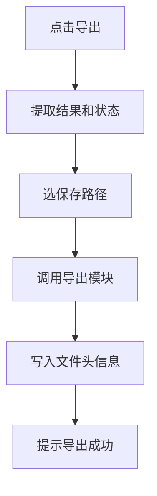

# 3.2 GUI与控制模块详细设计

GUI与控制模块是用户与系统交互的入口，负责接收用户输入、调度后台计算任务，并将算法、可视化和文件IO模块的结果整合展示在统一窗口中。模块基于Java Swing实现，采用视图与控制器分离的设计思想：界面组件只负责展示和接收事件，所有业务逻辑都由MainController统一调度，保证界面响应流畅，耗时计算不阻塞UI线程。

## 3.2.1 类设计

模块共包含7个核心类，分布在`ui`和`util`两个包中，各自职责清晰，如下表所示：

| 类名 | 所在包 | 职责说明 |
|------|--------|----------|
| MainFrame | ui | 主窗口，负责整体三栏布局，持有所有界面组件的引用，是程序启动入口 |
| MainController | ui | 主控制器，接收所有UI事件，调度后台线程，对接A的算法、C的可视化、D的IO模块，处理跨模块联动 |
| InputPanel | ui | 左侧输入面板，包含多行文本编辑区、导入文件按钮、清空按钮、示例数据按钮 |
| ResultPanel | ui | 右侧结果面板，JList分页显示拓扑排序结果，处理翻页、选中联动、双击复制 |
| StatusBar | ui | 底部状态栏，左侧显示节点数/边数/结果总数，右侧显示状态提示 |
| UIStyle | util | 统一UI样式工具类，管理全局配色、字体、按钮圆角和悬停效果 |
| ExceptionHandler | util | 统一异常弹窗工具类，所有错误都通过弹窗展示中文提示和错误行号 |

### 类之间调用关系

### MainController 核心方法

MainController作为整个GUI层的中间层，主要方法如下：

- `compute()`：接收"计算"按钮点击事件，校验输入非空，创建SwingWorker后台任务执行计算流程
- `cancelCompute()`：接收"取消"按钮点击事件，设置全局取消标记，通知算法中断搜索
- `applyEnumerationResult()`：计算完成后回到UI线程，将图传给GraphPanel绘制，将结果传给ResultPanel分页显示，更新状态栏统计
- `onSequenceSelected()`：接收结果列表选中事件，将选中序列和序号传给GraphPanel，高亮对应拓扑路径
- `exportResult()`：接收导出按钮事件，调用D的FileManager导出TXT/CSV，传入结果完整性和停止原因
- `statusText()`：更新状态栏右侧的状态提示文字

## 3.2.2 核心流程

### 计算与显示完整流程

用户点击"计算"按钮后，系统执行完整计算流程，全程在后台线程运行，不阻塞UI：

计算过程中，主线程仍然可以响应用户操作，用户点击"取消计算"时设置取消标记，算法在每层递归前检查并停止。如果图中检测到环，状态栏提示"输入图含环，无合法拓扑排序"，GraphPanel用红色高亮环路径。

### 结果选中联动流程

用户在结果列表中点击某一条拓扑排序时，系统同步高亮图上对应路径：

切换不同结果时，GraphPanel自动清除上一次的高亮，按新结果重新绘制。用户双击某条结果，ResultPanel自动将该条序列拼接成字符串复制到剪贴板。

### 导出流程

用户点击"导出结果"按钮时，系统执行导出：

导出时一定会在文件头写明结果状态，比如"结果完整，共X条"或"达到1000条上限，仅显示前1000条"，不会把截断的结果标成全部，符合接口契约要求。

## 3.2.3 交互设计

### 整体布局

主窗口采用顶部工具栏、中部三栏分割面板、底部状态栏的结构：

- **顶部工具栏**：JToolBar放置高频操作按钮，从左到右依次为：打开文件、清空输入、计算、取消计算、导出结果、导出图片、布局切换
- **中部三栏**：JSplitPane水平分割为三栏，宽度可拖拽调整：左侧InputPanel、中间GraphPanel、右侧ResultPanel
- **底部状态栏**：JStatusBar，左侧显示统计信息（节点数、边数、结果总数），右侧显示状态提示

窗口默认大小为1280×720，最小尺寸800×600，各栏在窗口缩放时自动适配，内容超出时自动出现滚动条。

### 结果分页设计

ResultPanel采用分页机制显示结果，避免一次性渲染上千条结果导致界面卡顿：

- 每页固定显示20条结果，JList只渲染当前页的条目
- 面板顶部显示结果总数和完整性提示，比如"共128条结果"或"达到上限1000条，仅显示前1000条"
- 面板底部显示"当前页/总页数"，配"上一页""下一页"按钮
- 用户双击某条结果，自动将该条序列复制到剪贴板
- 列表中每条结果用`->`连接节点，和界面显示、导出文件格式保持一致

### 统一UI样式

UIStyle工具类统一管理整个界面的视觉风格，保证所有组件风格一致：

- **配色**：主色为低饱和度蓝色，正常按钮为浅蓝背景，鼠标悬停时颜色加深
- **字体**：统一使用系统默认无衬线字体，正文和按钮为14号，状态栏和提示文字为12号
- **按钮**：统一圆角8px，浅灰色边框，工具栏按钮和画布上的悬浮按钮都通过UIStyle配置
- **弹窗**：错误提示使用红色标题栏，普通提示使用蓝色标题栏，错误信息居中显示

开发过程中发现Windows Swing对部分Unicode特殊符号（如循环箭头⟲、放大镜emoji）支持不好，会显示为方框，最终所有按钮上都使用中文文字标注，避免乱码问题。

### 异常处理设计

整个GUI模块采用统一异常处理机制，所有错误都通过ExceptionHandler弹窗展示：

- **输入为空**：提示"请输入关系数据后再计算"
- **解析错误**：提示"第X行格式错误，请检查是否为<a,b>格式"，带上具体行号
- **导出失败**：提示具体错误原因，比如"文件被占用"或"没有写入权限"
- **计算中异常**：捕获后弹窗提示，同时保留已经生成的结果，不会整个程序崩溃
