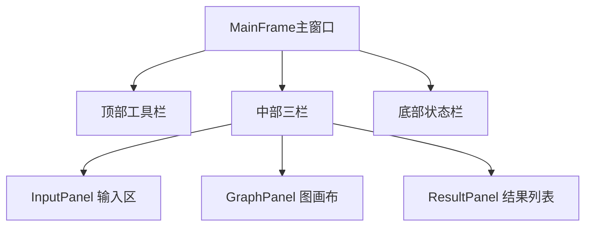

# B负责部分：需求分析与GUI设计

## 一、需求分析

### 1.1 功能需求（GUI相关部分）
- 提供图形化主窗口，支持文本输入、关系图显示、结果列表展示三栏布局
- 支持点击"计算"按钮触发拓扑排序，计算过程后台运行不卡界面
- 支持"取消计算"按钮中断正在运行的枚举任务
- 结果列表分页显示，每页20条，支持翻页
- 点击结果列表某一行，关系图同步高亮对应拓扑序，节点标注顺序序号
- 支持导出结果为TXT/CSV，导出文件头写明结果是否完整和停止原因
- 统一异常弹窗，所有错误用中文提示，带行号

### 1.2 非功能需求
- 界面响应流畅，千条结果分页渲染不卡顿
- 所有耗时操作在后台线程，UI线程始终响应
- 跨平台Windows Swing，无第三方依赖
- 按钮和文字风格统一，无乱码

## 二、GUI设计

### 2.1 整体布局
主窗口采用顶部工具栏、中部三栏分割、底部状态栏结构：

### 2.2 组件职责
| 组件 | 职责 |
|------|------|
| InputPanel | 多行文本输入，导入文件、清空按钮 |
| ResultPanel | 分页显示结果，选中事件回调 |
| StatusBar | 显示节点数、边数、结果总数、状态提示 |
| MainController | 调度后台任务，对接A/C/D模块 |

### 2.3 交互流程
用户从输入到导出的完整交互流程：

## 三、与其他模块的对接
- 对接A：接收EnumerationResult，提取结果列表、是否完整、停止原因
- 对接C：把Graph传给GraphPanel绘制，把选中序列传给高亮
- 对接D：调用DataParser解析输入，调用FileManager导出文件
