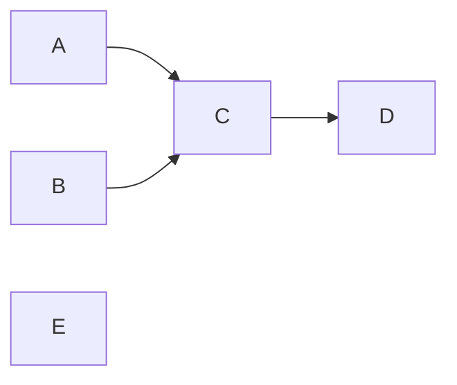

# 图数据结构设计

本文对应 T-A1，为 V1.0 正式版，由 A 编写，已于 2026 年 9 月 17 日经团队会议确认。本文规定图结构的存储方式、操作行为和验收要求，作为 Graph 实现及其他模块调用的设计依据。文中的手工小图用于说明设计，实际源码完成情况与测试结果由独立验证记录说明。

## 一、图模型与关系含义

本项目要保存的是“有哪些课程，以及课程之间有哪些直接的先后关系”。一门课程对应一个顶点，一条直接先后关系对应一条有向边；例如 `A → C` 表示 A 必须排在 C 前面。Graph 是这些顶点和边组成的整体，后续排序、环检测和绘图都读取同一套关系。

D 的解析器按照接口契约调用 Graph 方法建立图，并通过 `ParseResult.getGraph()` 返回。B 和 E 检查解析问题后，直接使用返回的图调用算法或绘图，无需分别将边列表转换为图。本文中的 Vertex、Edge、Graph 属于 `model` 包，图模型不依赖解析器内部的临时数据类型。

下面的小图包含 A、B、C、D、E 五个节点，直接关系为 `A → C`、`B → C`、`C → D`，E 没有任何连边。A 和 B 都必须先于 C，C 必须先于 D，但 A 与 B 之间没有规定先后。E 是孤立节点，虽然没有边，也必须保存在图里并出现在完整的拓扑序列中。



Graph 保存这三条直接关系，不额外添加 `A → D`、`B → D` 来表达可以推导出的间接关系。拓扑排序负责根据这些约束计算合法顺序，Graph 本身不负责选择哪一种顺序。界面上的坐标、颜色和缩放也不是课程依赖关系的一部分，由绘图模块单独保存。

## 二、Vertex、Edge、Graph 分别负责什么

| 对象 | 通俗理解 | 保存的内容 | 主要职责 |
| --- | --- | --- | --- |
| `Vertex` | 一张课程卡片 | 节点名称、直接后继名称集合、直接前驱名称集合 | 表达一个节点及其直接邻接关系 |
| `Edge` | 一条有方向的关系 | 起点名称 from、终点名称 to | 表达一条边的两个端点，判断两条边是否相同 |
| `Graph` | 管理全部课程卡片的总表 | 名称到 Vertex 的映射、边数 | 统一添加和删除关系，提供查询，保证数据一致 |

节点名称充当唯一标识，例如 `CS 150` 既是显示名称，也是查询这个节点的键。图模型不单独保存数字编号，算法需要数组时可以临时建立“名称到下标”的对应表。节点创建后不直接修改名称，外部模块也不直接修改 Vertex 中的邻接集合，所有关系变更都经过 Graph。

`Edge(A, C)` 与 `Edge(C, A)` 表示不同的有向边，而两个端点都相同的 Edge 表示同一条边。Edge 作为不可变的关系对象，比较时同时考虑起点和终点；若实现 `equals`，也应实现与之保持一致的 `hashCode`。Graph 不维护独立的全图 Edge 列表，遍历每个节点的后继即可得到全部边，需要关系对象时再用端点构造 Edge，避免重复维护同一份关系。

## 三、图在内存中怎样保存

### 1. 用映射按名称找到节点

Graph 内部使用 `LinkedHashMap<String, Vertex>` 保存节点，可以把它理解为“输入课程名称，就能找到对应课程卡片的表”。`Map` 表示键到值的对应关系，同一个名称只对应一个节点；`LinkedHashMap` 还保留节点首次插入的顺序。它不按名称字母顺序排序，主要用于让相同输入下的遍历顺序可复现。

### 2. 用集合保存前驱和后继

每个 Vertex 内部使用两个 `LinkedHashSet<String>`，分别保存直接后继和直接前驱。后继是当前节点直接指向的节点，前驱是直接指向当前节点的节点；`Set` 的元素不重复，因此同一关系不会出现两次。`LinkedHashSet` 同时保留首次插入顺序，这种“每个节点列出相邻节点”的保存方式属于邻接表。

对上面的小图，内部信息可理解为下表。入度等于直接前驱的数量，出度等于直接后继的数量；只有直接关系参与计数，能够沿多条边到达某节点不等于存在一条直接边。表中的方括号只用于展示集合内容，不表示内部必须使用 List 保存。

| 节点名称 | 直接后继 | 直接前驱 | 入度 | 出度 |
| --- | --- | --- | --- | --- |
| A | `[C]` | `[]` | 0 | 1 |
| B | `[C]` | `[]` | 0 | 1 |
| C | `[D]` | `[A, B]` | 2 | 1 |
| D | `[]` | `[C]` | 1 | 0 |
| E | `[]` | `[]` | 0 | 0 |

节点数直接取映射大小，这个例子中是 5。边数由 Graph 维护，这个例子中是 3，只有真正新增或删除一条边时才更新。Graph 不再为每个节点长期保存另一份可变入度，直接取前驱集合的大小即可，出度同样取后继集合的大小。

### 3. 哪些数据必须保持一致

一条 `A → C` 同时体现在“A 的后继包含 C”和“C 的前驱包含 A”两处，Graph 必须同时维护它们。邻接集合中的每个名称都必须能在节点映射中找到，不能留下指向不存在节点的关系。全图所有节点的入度之和、出度之和都应等于边数，这也可以用来检查实现是否漏更新。

同时保存前驱和后继会让一条边记录在两处，但可以直接查询入度并方便删除关系。图结构的空间规模仍为 `O(V + E)`，其中 V 是节点数、E 是边数。这里省略了字符串本身的长度和集合对象的固定开销，不把这个表达式当成实际字节数。

## 四、Graph 对外提供哪些操作

下表与接口契约中的 Graph 方法保持一致，说明各方法的输入和行为。实现方依据这些签名提供能力，调用方依据相同约定组织数据和验证结果。算法与绘图通过这些方法读取图，不依赖 Vertex 的可变内部字段。

| 方法签名 | 含义 | 示例或预期结果 |
| --- | --- | --- |
| `boolean addVertex(String name)` | 添加节点 | 第一次添加 E 返回 true，再次添加返回 false |
| `boolean addEdge(String from, String to)` | 添加有向边，自动补齐缺失端点 | 首次添加 A → C 返回 true，重复添加返回 false |
| `boolean removeEdge(String from, String to)` | 删除指定有向边，保留节点 | 删除已有关系返回 true；两端存在但关系不存在时返回 false |
| `List<String> getVertexNames()` | 读取全部节点名称 | 按示例节点录入顺序返回 `[A, B, C, D, E]` |
| `List<String> getSuccessors(String name)` | 读取直接后继名称 | 查询 C 得到 `[D]` |
| `int getInDegree(String name)` | 查询直接前驱数量 | 查询 C 得到 2 |
| `int getOutDegree(String name)` | 查询直接后继数量 | 查询 C 得到 1 |
| `int getVertexCount()` | 查询节点数量 | 得到 5 |
| `int getEdgeCount()` | 查询有向边数量 | 得到 3 |

内部保存前驱集合不等于必须增加公开的前驱查询方法，当前方法集合已经能支持基础排序和按后继遍历。遍历全图时，先取得全部节点名称，再逐个读取其后继；对每个“当前名称、后继名称”组合就能得到一条边。必须先取得全部节点，不能只从边推导节点，否则会遗漏 E 这样的孤立节点。

## 五、添加、删除和查询的具体过程

### 1. 添加节点与名称处理

Graph 以去掉首尾空白后的名称作为标识，保留内部空格并区分大小写，因此 ` A ` 与 `A` 指向同一个节点，而 `A` 与 `a` 不同。中文名称以及 `MA 141`、`CS 225` 这样的带内部空格的名称均按接口契约接受，不删除空格或拆分成多个节点。Graph 的各个公开方法使用一致的名称处理方式，空引用、处理后的空名称、含格式分隔符或换行等不符合契约规则的名称应明确拒绝；文件格式和行号等文本解析职责由解析层承担。

添加节点时先验证名称，然后在映射中查找；节点已存在时返回 false，不覆盖原有关系。节点不存在时创建 Vertex，将前驱和后继初始化为空集合，再放入映射并返回 true。添加边涉及两个名称，应先验证两个参数，再变更图，避免发现第二个参数无效时已经添加了第一个节点。

### 2. 添加一条边

以空图添加 `A → C` 为例，Graph 先创建缺失的 A 和 C，再将 C 加入 A 的后继集合，并将 A 加入 C 的前驱集合。两处关系都建立后，边数从 0 增加到 1，A 的出度和 C 的入度自然变为 1。再次添加相同关系时，集合已经包含该关系，返回 false，边数与入度均保持不变。

自环 `A → A` 也按真实关系保存，A 的后继和前驱中各出现一次 A，边数增加 1，入度和出度各增加 1。保留自环可以让后续环检测明确报告循环依赖，不会把原本有问题的输入悄悄变成无环图。Graph 同样可以保存两点互相指向或更长的环，它负责忠实存储，是否能拓扑排序由算法判断。

解析器返回的 Graph 遵循相同规则，不能只在提示信息或独立列表中记录自环而遗漏图中的关系。格式正确的自环属于图的循环依赖，由环检测按接口契约返回 `[A, A]`。重复输入同一条自环时仍按重复边去重，图中只保存一条，入度、出度和边数不重复增加。

### 3. 删除一条边

删除已有的 `A → C` 时，从 A 的后继中移除 C，从 C 的前驱中移除 A，再将边数减 1。A 和 C 节点继续保留，即使删除后其中一个变成孤立节点，也不能顺便将其删除。两端节点都存在、但边不存在时返回 false，不减少边数。

### 4. 查询与错误

查询节点名称或后继名称时，返回值应阻止调用者绕过 Graph 修改内部关系。只读视图表示不能通过该返回对象修改集合，但之后 Graph 的变化可能反映在视图里；独立副本则不随后续变化更新，副本本身是否可修改取决于返回方式。调用者不得依赖图变更后旧列表是否自动刷新，需要最新数据时重新查询；改变原图必须通过 Graph 的添加或删除方法。

查询不存在的节点时，Graph 抛出明确的参数异常，避免把“节点不存在”混同于“这个节点入度为 0”。Graph 不弹出对话框，也不输出界面提示，由调用它的界面或测试程序处理异常。整张空图本身是合法的数据结构，节点数与边数均为 0，遍历节点得到空列表。

## 六、算法和绘图怎样使用它

Kahn 排序会不断减小尚未处理节点的入度，这些减小只是计算过程中的临时状态，不能修改 Graph 中的前驱集合。算法开始时读取每个节点的入度，建立自己的局部入度表；处理一个节点后，只减少局部表中后继节点的数值。这样计算结束后，原图的边、入度和后续查询结果仍然保持原样。

在示例中，初始局部入度为 `A=0，B=0，C=2，D=1，E=0`。处理 A 后，局部 C 入度由 2 变成 1；处理 B 后，再由 1 变成 0，此时 C 才可以被选择。Graph 中 C 的原始入度始终是 2，因为输入的两条前置关系没有被删除。

多序列枚举同样使用自己的候选节点、当前路径和入度状态，回溯时恢复的是这些临时数据。环检测读取后继关系，将访问标记与路径保存在算法内部。任何一种算法的完成、取消或失败，都不应通过删除原图边来实现状态恢复。

绘图模块读取全部节点和每个节点的后继，将真实存在的有向边画出来。它另外维护布局坐标、颜色和选中状态，显示一条拓扑序列时也不能把原图不存在的边加进去。Graph 在本方案中是可变结构，单个查询返回只读列表并不等于整图线程安全；后台计算需要稳定的数据，其间的编辑限制或整图快照由上层协作机制保证。

## 七、调用示例

下面的 Java 调用片段展示接口的使用方式，先添加全部节点，再添加关系，因此节点录入顺序为 A、B、C、D、E。注释给出各调用应满足的结果，可用于编写自测。显示顺序来自首次插入顺序，不代表拓扑排序只能得到这一种节点顺序。

```java
Graph graph = new Graph();
graph.addVertex("A");
graph.addVertex("B");
graph.addVertex("C");
graph.addVertex("D");
graph.addVertex("E");

graph.addEdge("A", "C");
graph.addEdge("B", "C");
graph.addEdge("C", "D");

graph.getVertexCount();     // 预期为 5
graph.getEdgeCount();       // 预期为 3
graph.getSuccessors("C");  // 预期为 [D]
graph.getInDegree("C");    // 预期为 2
graph.addEdge("A", "C");   // 预期为 false，关系未增加
graph.removeEdge("A", "C"); // 预期为 true
graph.getInDegree("C");    // 预期为 1
graph.getEdgeCount();       // 预期为 2
```

删除之前，`A、B、C、D、E` 和 `B、A、E、C、D` 都是满足这张图的合法拓扑序列。Graph 只保存约束，所以不会在添加关系时存下一条固定排序答案。算法检查完整结果时，需要确认所有节点恰好出现一次，并且每条边的起点都排在终点之前。

## 八、验收要求

下表规定实现必须满足的行为，作为自测与独立验证的依据。每个独立用例从新图开始，避免前一个用例的增删影响后一个用例。实际执行时另外保存输入与输出，验收要求本身不作为测试通过证明。

| 用例 | 预期检查点 |
| --- | --- |
| 空图 | 节点数、边数均为 0，节点列表为空 |
| 只添加 E | 节点数为 1，边数为 0，入度与出度均为 0 |
| 空图添加 A → B | 自动建立两个节点，边数为 1，A 出度与 B 入度均为 1 |
| 重复添加节点 A | 返回 false，不重置 A 已有关系 |
| 两次添加 A → B | 第二次返回 false，边数和相关度数不变 |
| 添加 A → A | 节点数为 1、边数为 1，A 入度和出度均为 1 |
| 添加 A → B、B → A | 保存两条不同的有向边，每个节点入度、出度均为 1 |
| 添加 A → C、B → C | C 入度为 2，全图入度之和与出度之和均等于边数 2 |
| 删除已有 A → B | 边数减 1，两端节点保留，对应邻接关系与度数同步变化 |
| 再次删除同一条边 | 两端节点仍存在，返回 false，边数不再减少 |
| 无效名称作为添加边参数 | 操作被明确拒绝，不留下部分新增节点或关系 |
| 查询不存在的节点 | 得到明确的参数异常，不伪装成入度为 0 的节点 |
| 尝试修改查询返回的数据 | 不允许借此改变 Graph 的内部关系 |
| 按相同顺序建立相同图 | 节点和后继遍历顺序一致 |
| 算法重复计算或取消计算 | 接入算法后，比较计算前后节点、关系与度数，原图保持一致 |

## 九、实现范围与维护

T-A1 包括 Vertex、Edge、Graph，以及本文列出的建图、删边、查询和遍历能力。额外公开的前驱查询方法、删除节点和节点改名未纳入本版接口，文件解析、界面绘图和具体排序算法由各自模块实现。源码、关键方法说明与真实的命令行自测输出构成实现交付，本文作为长期维护的设计依据。

手工小图足以支持 Graph 的基础开发和验证，不需要先完成解析器。任务书图 1 的照片可以用于整理节点与有向边，但方向和端点必须核对准确，之后才成为正式验证输入。Graph 的基本自测通过，与任务书图 1 的算法验证完成，是两项不同的成果。

图模型的公开方法或行为发生变化时，同步更新接口契约与本设计，并通知受影响的调用方。内部存储的调整应保持节点、邻接关系和度数的一致性，重新执行相关验收用例。正式设计用于持续指导实现和维护，不因一次会议确认完成而失去用途。
