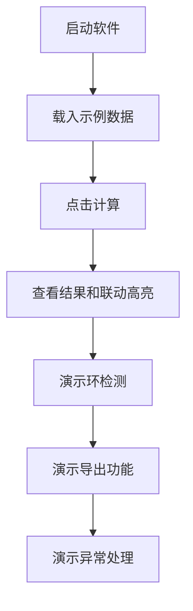
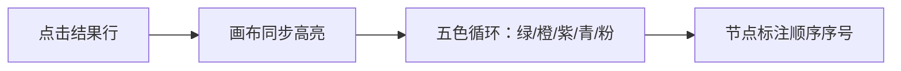

# B交付E的测试和录视频演示流程

## 一、演示总流程

---

## 二、详细演示步骤

### 1. 启动软件
1. 双击`run.bat`启动程序，或者命令行运行`java -jar TopoSortApp.jar`
2. 展示主界面三栏布局：左侧输入区、中间关系图、右侧结果列表、底部状态栏
3. 旁白：这是我们的拓扑排序工具，输入课程先修关系，自动绘制关系图并枚举所有合法拓扑排序

### 2. 载入示例数据
1. 点【打开文件】按钮，选择`data/curriculum.txt`
2. 左侧文本区自动加载所有先修关系
3. 中间关系图自动分层布局，所有节点默认蓝色
4. 旁白：支持从TXT文件导入课程关系数据，自动绘制关系图

### 3. 计算拓扑排序
1. 点【计算】按钮
2. 状态栏显示节点数、边数、结果总数和耗时
3. 右侧结果列表分页显示所有拓扑排序结果，每页20条
4. 翻页演示：点上一页/下一页切换
5. 旁白：点击计算后，算法自动枚举所有合法拓扑序，默认上限1000条，支持分页查看

### 4. 结果联动高亮

1. 点第1条结果：全图绿色高亮，节点右上角标注1、2、3...
2. 点第2条结果：全图橙色高亮，节点序号位置变化
3. 点第3条结果：全图紫色高亮
4. 双击某条结果：自动复制到剪贴板
5. 旁白：点击任意结果，关系图同步高亮这条序列，不同结果用不同颜色区分，节点序号表示该节点在序列中的位置

### 5. 环检测演示
1. 清空输入，输入三条有环的边：`<A,B>`、`<B,C>`、`<C,A>`
2. 点【计算】
3. 弹窗提示图中存在环
4. 关系图上环上的节点和边全部红色高亮
5. 状态栏显示"含环"
6. 旁白：输入有环图时，系统自动检测并红色高亮环路径，无法生成拓扑排序

### 6. 导出功能演示
1. 切回curriculum.txt，重新计算
2. 点【导出结果】，保存为TXT文件，打开文件展示文件头的完整性说明
3. 点【导出图片】，保存关系图为PNG
4. 旁白：支持导出排序结果为TXT/CSV，也支持导出关系图为PNG图片，导出文件头会写明结果是否完整

### 7. 异常输入演示
1. 输入不完整的边：`<A,`
2. 点计算，弹窗提示具体行号和错误原因
3. 旁白：所有非法输入都会给出明确的中文错误提示和行号定位，不会崩溃
