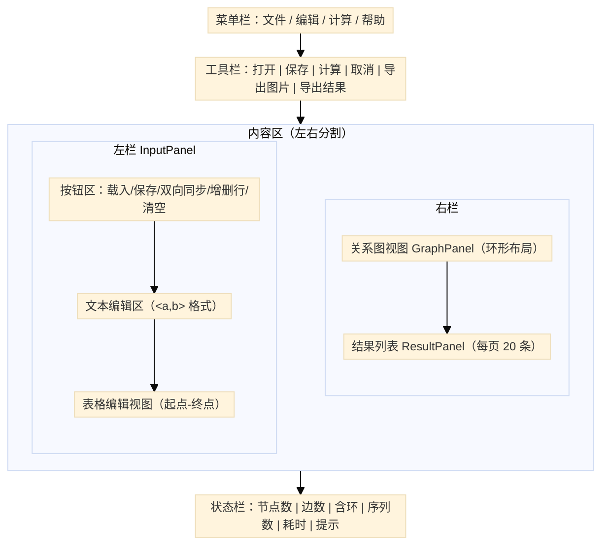
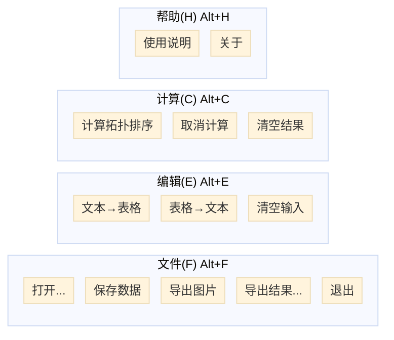
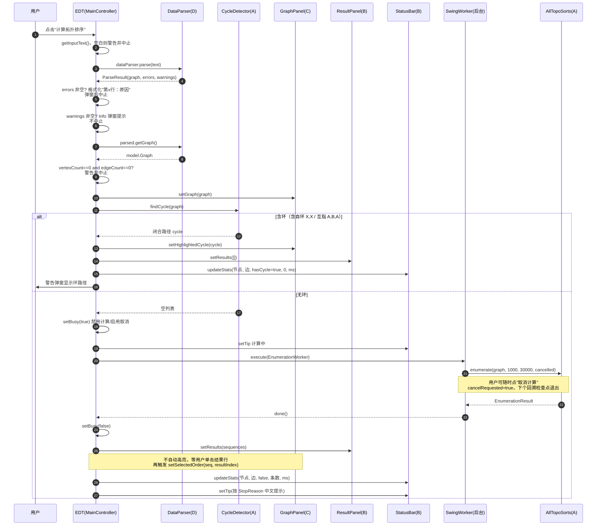
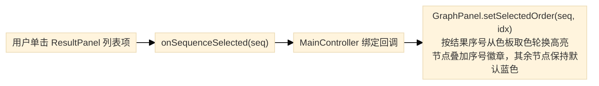
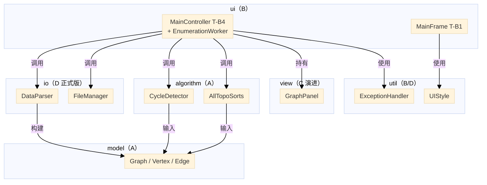
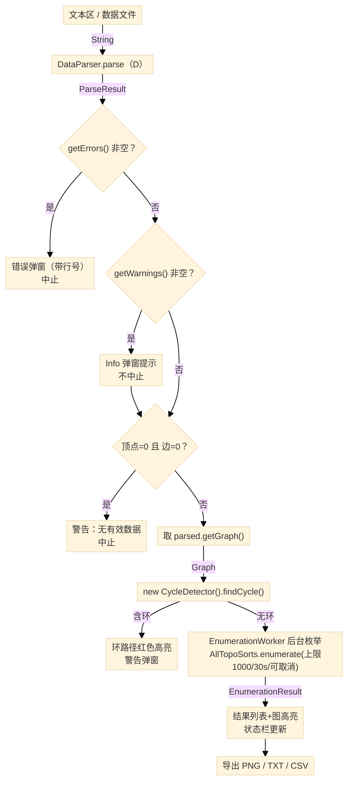
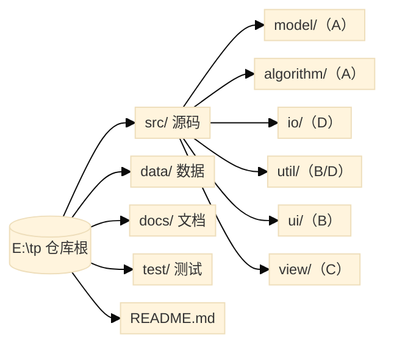

# 拓扑排序应用软件 详细设计报告（GUI 部分）

本报告由组员 B 编写，对应 GUI 主框架与交互控制部分（任务 T-B1 ~ T-B8）的详细设计，属于项目 CST4823A 高级算法原理实践，指导教师廖海泳 / 陈银冬。报告描述界面布局、事件处理流程、GUI 类结构与调用关系。文档版本 V1.5，更新日期 2026 年 9 月 20 日：V1.5 起完善结果高亮交互——无环图节点默认蓝色填充+蓝色边框、边灰色，有环图自动标红环节点与环边；单击结果后该序列节点按结果序号从五色色板（绿/橙/紫/青/粉，循环）轮换高亮并叠加序号徽章（拓扑序列必含全部节点，仅靠单一颜色无法区分不同序列），换页不清除高亮；画布字体改用逻辑字体 Font.SANS_SERIF。V1.4 起接入 C 交付的 GraphPanel（环形布局+环高亮+拓扑序高亮+PNG导出），替换 B 占位实现。V1.3 起 io 包已接入 D 正式版（`DataParser` / `ParseResult` / `ParseIssue`），`ParseIssue` 方法名为 `getLineNumber() / getMessage()`，枚举上限按接口契约统一为 1000 条 / 30 秒 / 可取消。V1.2 历史：B 侧对接方式按跨模块接口契约 V1.0 重写——`MainController` 与 `InputPanel` 不再通过 `DataParser.Edge` 边列表手动建图，改为直接调用 `ParseResult.getGraph()` 取得 `model.Graph`；问题类型由 `DataParser.ParseError` 升级为顶层 `io.ParseIssue`。V1.1 中 §7.3 记录的"InputValidator 规则不一致"与"A 新版契约未合入"两项遗留由此关闭。

## 一、设计概述

### 1.1 设计目标

本详细设计报告针对 GUI 主框架与交互控制部分（组员 B 任务 T-B1 ~ T-B8），描述界面布局、事件处理流程、GUI 类结构与调用关系，作为编码实现与现场验收的直接依据。V1.5 中描述的全部类、方法签名、流程与常量均与 dev-b 分支源码一致，并与跨模块接口契约 V1.0 完全对齐。

### 1.2 设计原则

- **面向对象**：每个面板、控制器均为独立类，职责单一；
- **MVC 分层**：Model（model / algorithm 包）— View（ui / view 包的 Swing 组件）— Controller（MainController 编排）；
- **配置集中**：UIStyle 工具类统一管理配色、字体、间距；
- **异常友好**：用户操作异常均经 try-catch 包装，错误中文提示，解析错误带行号定位；
- **复用而非重造**：按 9.17 会议决议，输入解析唯一入口为 D 的 io.DataParser，文件读写复用 io.FileManager，B 不另写解析器；
- **UI 不冻结**：全拓扑枚举在 SwingWorker 后台线程执行，提供取消按钮与结果上限、超时保护。

### 1.3 设计约束

- 运行环境：JDK 21（团队统一目标），零外部依赖；
- GUI 框架：Swing；
- 源码编码：UTF-8 无 BOM，编译必须带 `-encoding UTF-8`；
- 中文字体：界面字体使用"微软雅黑"，文本区/结果列表使用逻辑字体 Font.MONOSPACED（物理字体 Consolas 不含中文字形会把中文渲染成方块，逻辑字体可自动回退中文字体）；
- 接口契约：算法层与解析层均严格遵循契约 V1.0——B 直接调用 `ParseResult.getGraph()` 取得 `model.Graph`，不再在 B 侧建图；问题类型 `io.ParseIssue`、解析器 `io.DataParser` 均按契约交付；
- 画布：C 已交付 GraphPanel（环形布局 + 环路径红色高亮 + 选中序列按结果序号轮换色板高亮并叠加序号徽章 + PNG 导出）。

### 1.4 9.17 会议决议对 GUI 的影响

1. D 的解析器为项目标准入口，B 直接复用，删除 B 侧全部解析桩；
2. 解析结果按契约 V1.0 §6 以"Graph + 错误清单 + 警告清单"表达，B 通过 `ParseResult.getGraph()` 直接取得 `model.Graph`，不再调用 `Graph.addEdge` 手动建图；
3. 本期先解决 UTF-8 中文显示，中英文切换后续迭代；
4. 画布先做静态布局，悬停高亮、点击反馈延后；
5. 节点在图上最终展示为"编码 + 课程名"两行（当前数据文件仅含编码，课程名映射待数据补充）。

---

## 二、界面布局设计

### 2.1 整体布局

主窗口采用**三段式垂直布局**（菜单栏—工具栏—内容区—状态栏）：



文本区启动时的默认内容（均为 `#` 注释与示例边）：

```
# 请按 <a,b> 格式输入数据，每行一条关系，# 开头为注释
# a 为前驱，b 为后继，如 <a,b> 表示有向边 a -> b
# 示例：
<MA 140,MA 141>
<MA 141,CS 150>
```

### 2.2 布局组件说明

| 区域 | 组件 | 职责 |
|---|---|---|
| 菜单栏 | JMenuBar | 文件 / 编辑 / 计算 / 帮助 四个菜单，均注册 Alt+字母 助记符 |
| 工具栏 | JToolBar | 打开 / 保存 / 计算 / 取消计算 / 导出图片 / 导出结果 六个文字按钮 |
| 左栏 | InputPanel | 上文本区、下表格视图（垂直分割），载入/保存/双向同步/增删行/清空七个按钮 |
| 右栏上 | GraphPanel（view 包，C 交付） | 环形布局，绘制有向箭头与自环；环路径红色加粗、选中序列按结果序号轮换颜色（绿/橙/紫/青/粉）并叠加序号徽章 |
| 右栏下 | ResultPanel | 结果分页列表（每页 20 条），总数/页码、单击高亮、双击复制 |
| 状态栏 | StatusBar | 节点数 / 边数 / 含环 / 序列数 / 耗时 / 右侧动态提示 |

### 2.3 菜单结构



说明：当前只注册了 Alt+字母 菜单助记符（setMnemonic），未注册 Ctrl+ 加速键；"计算"与"取消计算"按枚举运行状态互斥启用。

### 2.4 状态栏布局

```
[节点: N] | [边数: M] | [无环/含环] | [序列数: K] | [耗时: tms]    [提示文本]
```

- 左侧 5 个统计标签使用 `|` 分隔；
- 右侧提示文本随操作变化（就绪 / 计算中 / 枚举完成共 N 条 / 达到上限 / 超时 / 已取消 / 检测到环）；
- 含环时"含环"标签变红，无环时"无环"标签变绿。

---

## 三、事件处理时序

### 3.1 计算按钮点击后的完整流程

下图使用 Mermaid `sequenceDiagram` 绘制，GitHub / GitLab / Gitea 等仓库均原生渲染。EDT 与 SwingWorker 后台线程的协作、契约 §6 的 `ParseResult.getGraph()` 直接交付、以及 `getErrors/getWarnings` 的分流均可在图中定位：



### 3.2 关键事件序列（文字版）

1. 用户点击"计算拓扑排序"（菜单项或工具栏按钮触发同一入口）；
2. MainController.compute() 取输入文本，空白（仅空白字符）直接警告并中止；
3. 调用契约 §6 规定的实例方法 `dataParser.parse(text)`（B 持有 `new DataParser()` 实例），返回顶层 `io.ParseResult`；
4. `parsed.getErrors()` 非空时，把每条 `ParseIssue` 格式化为"第x行：原因"（`getLineNumber()==0` 的全局性错误只显示原因），最多展示 20 条后**中止流程**；
5. `parsed.getWarnings()` 非空时（如重复关系），按相同格式 Info 弹窗提示（最多 10 条），**不中止**；
6. **直接取图**：`Graph graph = parsed.getGraph();` ——B 不再调 `Graph.addEdge`，建图职责完全由 D 在解析器内部完成（契约 §6 + 图设计 §一）；
7. 若 `graph.getVertexCount()==0 && graph.getEdgeCount()==0`，按契约 §6 "整份输入没有有效节点和关系" 由输入层提示，警告并中止；
8. `graphPanel.setGraph(graph)` 先把图交给画布布局；
9. `new CycleDetector().findCycle(graph)` 返回闭合路径列表；空列表表示无环；自环返回 `[X,X]`，两节点互指返回 `[A,B,A]`；
10. 有环：画布 `setHighlightedCycle` 标红、结果列表清空、状态栏按含环更新，弹窗显示环路径后结束；
11. 无环：setBusy 切换按钮状态，启动内部类 EnumerationWorker（继承 SwingWorker）；
12. 后台执行 `new AllTopoSorts().enumerate(graph, 1000, 30000, 取消谓词)`，结果上限 1000 条、超时 30 秒；
13. done() 回到 EDT：填充 ResultPanel（不自动高亮，等用户单击列表项）、状态栏更新统计；
14. 状态栏提示按 StopReason 区分：COMPLETED"枚举完成，共 N 条"、LIMIT_REACHED"达到结果上限"、TIMEOUT"超时停止"、CANCELLED"已取消，已显示部分序列"。

### 3.3 用户选中序列时的事件流



双击列表项或点击"复制当前"把 `a -> b -> c` 形式的序列写入系统剪贴板。

高亮交互约定：无环图节点默认蓝色填充+蓝色边框、边灰色；单击结果后该序列节点按该结果的序号从五色色板（绿/橙/紫/青/粉，循环）中取色填充，节点右上角叠加同色序号徽章（标示该节点在序列中的位置），单击另一条结果则颜色与徽章一起切换，切换分页不清除已选高亮（换页只重建列表模型，画布的选中状态独立保存）。由于任何拓扑序列都包含全部节点，仅靠单一颜色无法区分不同序列，因此采用颜色轮换+序号徽章双重区分。有环图由 `setHighlightedCycle` 自动把环上节点标红、环边红色加粗，无需点击；红色（环）与序列高亮是两种独立状态，不会同时出现。

### 3.4 文件操作事件流

文件对话框（JFileChooser）由 UI 层负责弹出，D 的 FileManager 只接收 File 参数并抛 IOException：

| 操作 | 触发位置 | 实际调用链 |
|---|---|---|
| 载入文件 | InputPanel"载入文件"按钮 / 菜单"打开" / 工具栏 | JFileChooser（初始目录取 FileManager.getLastOpenedDirectory）→ FileManager.readFile(File) → textArea.setText → syncTextToTable |
| 保存数据 | InputPanel"保存数据"按钮 / 菜单 / 工具栏 | JFileChooser（无扩展名自动补 .txt）→ FileManager.saveFile(File, text) |
| 导出图片 | 菜单 / 工具栏"导出图片" | 无图时先警告；JFileChooser → GraphPanel.exportPNG(File) |
| 导出结果 | 菜单 / 工具栏"导出结果" | 无结果时先警告；JFileChooser，.csv 走 FileManager.exportCsv（UTF-8 BOM），其余走 exportTxt（自动补 .txt） |

---

## 四、GUI 类设计

### 4.1 类结构总览



### 4.2 类职责说明

| 类 | 包 | 职责 | 任务编号 |
|---|---|---|---|
| MainFrame | ui | 主窗口，组装菜单/工具栏/分割面板/状态栏，main 入口内自行装配 MainController | T-B1 |
| InputPanel | ui | 文本区 + JTable 双视图，载入/保存/双向同步/增删行/清空，默认中文格式提示 | T-B2 |
| ResultPanel | ui | 结果分页列表（每页 20 条），总数与页码、翻页、单击回调、双击/按钮复制 | T-B3 |
| MainController | ui | 菜单与工具栏绑定、计算流程编排、SwingWorker 后台枚举与取消、导出 | T-B4 |
| StatusBar | ui | 节点/边/含环/序列数/耗时统计与右侧动态提示 | T-B5 |
| ExceptionHandler | util | 统一中文弹窗（错误/警告/信息/确认/问题清单/异常兜底） | T-B5 |
| UIStyle | util | 配色、字体（含中文兼容的逻辑等宽字体）、间距与组件样式 | T-B8 |
| GraphPanel | view | 环形画布：有向箭头/自环、环标红、选中序列高亮、PNG 导出 | C 交付 |

### 4.3 关键方法签名（均与源码一致）

```java
// ui.MainFrame
public MainFrame();
public InputPanel getInputPanel();
public GraphPanel getGraphPanel();
public ResultPanel getResultPanel();
public StatusBar getStatusBar();
public JMenuItem getMiCompute();   public JMenuItem getMiCancel();
public JButton getToolCompute();   public JButton getToolCancel();
// 其余 getMiOpen/getMiSave/... 与 getToolOpen/... 为同名 getter
public static void main(String[] args);   // 入口：new MainController(frame) 后 setVisible

// ui.InputPanel
public String getInputText();
public void setInputText(String text);
public void requestLoadFile();              // 供菜单/工具栏复用
public void requestSaveFile();
public void clearAll();
public void installDefaultSyncActions(Component dialogParent);
public void syncTextToTable();              // DataParser.parse 后填充普通边+自环
public void syncTableToText();

// ui.ResultPanel
public void setResults(List<List<String>> results);
public List<List<String>> getResults();
public int getSelectedResultIndex();   // 当前选中结果的全局序号，未选中返回 -1
public void setSelectionListener(SelectionListener listener);
interface SelectionListener { void onSequenceSelected(List<String> sequence); }

// ui.StatusBar
public void updateStats(int nodeCount, int edgeCount, boolean hasCycle,
                        int totalSorts, long costMs);
public void setTip(String text);
public void reset();

// ui.MainController
public MainController(MainFrame frame);
// 常量：MAX_RESULTS = 1000，TIMEOUT_MILLIS = 30000
private void compute();            // 解析→建图→判环→（环：结束 / 无环：后台枚举）
private void cancelCompute();      // cancelRequested=true 并 worker.cancel(true)
private void clearResults();
private void exportResult();       // txt/csv
private void exportPNG();
// 内部类：private class EnumerationWorker extends SwingWorker<EnumerationResult, Void>

// view.GraphPanel
public void setGraph(Graph graph);
public void setHighlightedCycle(List<String> closedCycle); // 闭合序列 [A,...,A]
public void setSelectedOrder(List<String> order);          // 契约方法保留，默认 0 号色板
public void setSelectedOrder(List<String> order, int resultIndex); // V1.5 新增重载：按结果序号轮换色板
public void exportPNG(File file) throws IOException;

// util.ExceptionHandler
public static void showError(Component parent, String message);
public static void showIssues(Component parent, List<String> messages, String title);
public static void showParseErrors(Component parent, List<String> messages);
public static void showWarning(Component parent, String message);
public static void showInfo(Component parent, String message);
public static boolean showConfirm(Component parent, String message);
public static void handle(Component parent, Throwable t);
```

---

## 五、与算法、解析模块的调用关系

### 5.1 调用契约清单（实际使用的签名）

| 调用方 | 被调方 | 方法 | 返回 | 何时调用 |
|---|---|---|---|---|
| MainController / InputPanel | io.DataParser | parse(String)（实例方法） | io.ParseResult | 计算前解析、文本→表格同步 |
| MainController | io.ParseResult | getGraph() / getErrors() / getWarnings() | model.Graph / List<ParseIssue> / List<ParseIssue> | 校验与取图 |
| MainController | algorithm.CycleDetector | 实例方法 findCycle(Graph)（new CycleDetector() 后调用） | List<String>（空=无环，闭合=有环） | 取图后判环 |
| EnumerationWorker | algorithm.AllTopoSorts | 实例方法 enumerate(Graph,int,long,BooleanSupplier)（new AllTopoSorts() 后调用） | EnumerationResult | 无环时后台枚举 |
| MainController | EnumerationResult | getSequences() / getGeneratedCount() / isComplete() / getStopReason() | — | 回填 UI 与提示 |
| MainController / InputPanel | io.FileManager | readFile / saveFile / exportTxt / exportCsv（均 static，File 参数，抛 IOException） | — | 文件读写与结果导出 |
| MainController | io.FileManager | exportTxt/exportCsv(File, List<String>, boolean isComplete, String stopReasonText)（新重载，契约 §七） | void | 正式业务导出，文件头写明完整性与停止原因 |
| MainController | view.GraphPanel | setGraph / setHighlightedCycle / setSelectedOrder / exportPNG | void | 画布刷新与导出 |
| MainController | ResultPanel / StatusBar | setResults / updateStats / setTip | void | 结果与状态刷新 |

补充类型：

- `io.ParseResult`：`Graph getGraph()`、`List<ParseIssue> getErrors()`、`List<ParseIssue> getWarnings()`；契约 §6 规定的顶层类型，B 不访问解析器内部的边/自环列表；
- `io.ParseIssue`：`int getLineNumber()`（1 起行号；0 表示整份输入级别的全局问题）、`String getMessage()`；
- `algorithm.TopoResult`：getOrder()、hasCycle()；`StopReason`：COMPLETED / LIMIT_REACHED / CANCELLED / TIMEOUT / CYCLE；
- 空图枚举按契约返回 `[[]]`（生成数 1、完整），含环图返回 CYCLE、序列为空。

### 5.2 Graph 公开能力（A 图设计，算法/视图层只允许使用这些方法）

`boolean addVertex(String)`、`boolean addEdge(String,String)`、`boolean removeEdge(String,String)`、`List<String> getVertexNames()`、`List<String> getSuccessors(String)`、`int getInDegree(String)`、`int getOutDegree(String)`、`int getVertexCount()`、`int getEdgeCount()`。Graph 不暴露 Vertex/Edge 内部结构，也不维护可供外部遍历的独立 Edge 列表；视图层通过 getVertexNames + getSuccessors 派生全部边（含自环——自环在 `getSuccessors(X)` 中表现为 `X` 自身）。

### 5.3 数据流图

下图使用 Mermaid `flowchart` 绘制，可在 GitHub / GitLab / Gitea 直接渲染。整份输入文本经 D 的 DataParser 解析为 ParseResult，B 直接取其 `getGraph()` 交付 Graph，不再手动建图：



---

## 六、异常处理设计

### 6.1 异常场景与处理方式（当前实现）

| 场景 | 判定位置 | 处理方式与用户反馈 |
|---|---|---|
| 输入为空白 | compute() 开头 | 警告"请输入关系数据后再计算"，中止 |
| 语法/格式错误（如缺少尖括号、括号不匹配） | ParseResult.getErrors() | 错误弹窗，逐行"第 x 行：原因"，最多 20 条，中止流程 |
| 可继续处理的提示（如重复关系） | ParseResult.getWarnings() | Info 弹窗提示，不中止；最终结果以 Graph 实际数据为准 |
| 只有注释/空行，无有效边 | graph.getVertexCount()==0 && getEdgeCount()==0 | 警告"没有有效的关系数据"，中止 |
| 重复边 | 解析器内部去重 | 不报错；以 `parsed.getWarnings()` 形式提示，不影响 Graph |
| 自环 `<x,x>` | 由 D 在 Graph 中保留为真实有向边 | findCycle 返回 [x,x]，画布标红 + 环警告 |
| 两节点互指/更长环 | findCycle | 闭合路径标红，结果列表清空，状态栏"含环" |
| 枚举达到上限 / 超时 / 被取消 | StopReason | 展示已生成序列，状态栏分别提示上限/超时/已取消 |
| 载入、保存 IO 失败 | InputPanel 内 try-catch | JOptionPane 错误弹窗（含异常消息） |
| 导出结果 / PNG 失败 | MainController try-catch | ExceptionHandler.handle 统一弹窗 |
| 导出时无结果/无图 | 导出方法开头 | 警告"请先计算"，不弹文件对话框 |

### 6.2 错误消息格式

解析错误在 MainController 中统一格式化后交给 ExceptionHandler：

```
第3行：格式错误：应为 <a,b>
第7行：顶点名不能为空
（getLineNumber() == 0 时省略"第x行："前缀，直接显示全局原因）
```

警告（`getWarnings()`，如重复关系）以 Info 弹窗同格式展示，不中止流程。

---

## 七、设计评审与遗留问题

### 7.1 已实现项与验证证据

| 任务 | 状态 | 验证 |
|---|---|---|
| T-B1 MainFrame | 完成（V1.0 起） | 全量 `-encoding UTF-8` 编译通过；GUI 启动截图，菜单/工具栏/分割布局正常 |
| T-B2 InputPanel | 完成（V1.2 调整） | 默认中文提示正常显示；载入/保存/双向同步/增删行可用；`syncTextToTable` 改为基于 `parsed.getGraph()` + `getVertexNames` + `getSuccessors` 派生表格行 |
| T-B3 ResultPanel | 完成（V1.0 起，V1.5 调整） | 每页 20 条分页、单击高亮回调、双击复制均已验证；V1.5 新增 `getSelectedResultIndex()` 支撑色板轮换 |
| T-B4 MainController | 完成（V1.2 调整） | `compute()` 直接取 `parsed.getGraph()`，不再手动建图；`getErrors()` 中止流程、`getWarnings()` 仅提示；后台枚举与取消按钮互斥启用 |
| T-B5 StatusBar + ExceptionHandler | 完成（V1.0 起） | 含环红色/无环绿色；错误弹窗带行号；V1.2 增加对 warning 流的 Info 弹窗 |
| T-B6/T-B7 文档 | 完成（V1.5） | 需求分析报告、本报告随代码同步更新至 V1.5 |
| T-B8 UIStyle | 完成（V1.1 起） | 全局样式统一；修复中文方块问题（Consolas → Font.MONOSPACED），V1.2 保持未回退 |

流水线验证（dev-b，V1.4）：全量 `javac -encoding UTF-8` 编译零错误；A 侧 GraphSelfTest 16/16、CycleDetectorSelfTest 19/19；D 侧 TestDataParser 35/35、TestFileManager 14/14、TestInputValidator 39/39；E 侧 AlgorithmTest 18/18、ParserFaultTest 15/15；23 项命令行链路冒烟全部通过——data/figure1.txt（15 节点/16 边，节点名含内部空格）解析后节点数/边数精确、Kahn 序列覆盖全部节点；重复边产生 warning 且不计入度数；自环返回 `[X,X]`；非法行返回带行号 error；全角 `＜＞，` 兼容；仅注释输入返回空 Graph 且无 error；小图全枚举恰得 2 条 COMPLETED 序列；孤立节点保留并进入每条序列；含环图枚举入口以 CYCLE 拒绝。

> 解析层现状：io 包已由 D 交付正式实现（`DataParser.parse` 实例方法 + 顶层 `ParseResult` / `ParseIssue`），B 已完整对接。D 的 `ParseIssue` 公开方法为 `getLineNumber() / getMessage()`，B 侧已适配。导出走 D 的新重载 `exportTxt/exportCsv(file, lines, isComplete, stopReasonText)`，B 在 MainController 中把 A 的 StopReason 枚举转成中文传入。

### 7.2 中文显示问题的排查结论

- 源码为 UTF-8 无 BOM，编译带 `-encoding UTF-8`，class 文件中字符串经 Unicode 转义探针核对完全正确（早期 javap 看到的乱码只是 PowerShell 控制台 GBK 代码页的显示问题）；
- 真正的显示故障是字体：文本区使用的物理字体 Consolas 不含中文字形，JTextArea/JList 中中文被画成方块（JLabel 使用微软雅黑因此正常）；
- 修复：UIStyle.FONT_MONO 改为逻辑字体 `new Font(Font.MONOSPACED, Font.PLAIN, 13)`，ASCII 仍等宽，中文自动回退，GUI 截图确认正常；
- V1.2 复核：UIStyle.FONT_MONO 保持 `Font.MONOSPACED` 未回退；中文字符在文本区、表格、结果列表、画布均正常渲染。

### 7.3 已知差异与遗留项

1. **解析器已接入 D 正式版**（V1.3）：D 交付的 `DataParser` / `ParseResult` / `ParseIssue` 已替换原 A 契约桩，`ParseIssue` 方法名为 `getLineNumber() / getMessage()`，B 侧已适配并通过 D 的自测（DataParser 35/35、FileManager 14/14、InputValidator 39/39）；
2. **画布已接入 C 正式版**（V1.4）：C 交付的 GraphPanel 提供 setGraph/setHighlightedCycle/setSelectedOrder/exportPNG 四个方法，与 MainController 对接完成；
3. **测试已接入 E 的 E1/E2**（V1.4）：AlgorithmTest 18/18（正确性/边界/环/性能）、ParserFaultTest 15/15（解析器容错），全部通过；
4. **节点两行展示**："编码 + 课程名"依赖课程名数据，curriculum.txt 目前以中文实践课名作为节点名的一部分存在，独立课程名映射尚未提供；
5. **快捷键与国际化**：仅 Alt 菜单助记符，无 Ctrl 加速键；界面文案中文硬编码，ResourceBundle 国际化后续迭代；
6. **V1.5 高亮交互完善**：无环图单击结果后按结果序号从五色色板（绿/橙/紫/青/粉）轮换高亮并叠加序号徽章——拓扑序列必含全部节点，单一颜色无法区分不同序列；换页不清除高亮；有环图自动标红不受影响；契约方法 `setSelectedOrder(List)` 原样保留，仅新增重载，与 A/C/D 接口完全兼容。已通过自动化 GUI 冒烟（两条序列点选切换截图核对颜色与徽章）验证。

> V1.1 遗留的"InputValidator 规则不一致"与"A 新版契约未合入 main"两项在 V1.2 中已通过 B 侧直接对接契约 V1.0 关闭：B 不依赖 `InputValidator`，也不再调用 `Graph.addEdge` 建图。

---

## 八、附录：包结构与构建运行

### 8.1 实际目录结构（dev-b）



### 8.2 编译与运行（PowerShell，必须显式指定 UTF-8）

```powershell
Set-Location "e:\tp\src"
$files = (Get-ChildItem -Recurse -Filter "*.java" |
          Where-Object { $_.Name -ne "package-info.java" }).FullName
$argList = @('-encoding','UTF-8','-d','out') + $files
& javac @argList

Set-Location out
java ui.MainFrame
```

注意：在 Windows PowerShell 中通过数组 splatting（`@argList`）传参，确保 `-encoding UTF-8` 真正传给 javac；直接写 `javac -encoding UTF-8 ...` 在部分调用方式下参数可能被吞掉。
