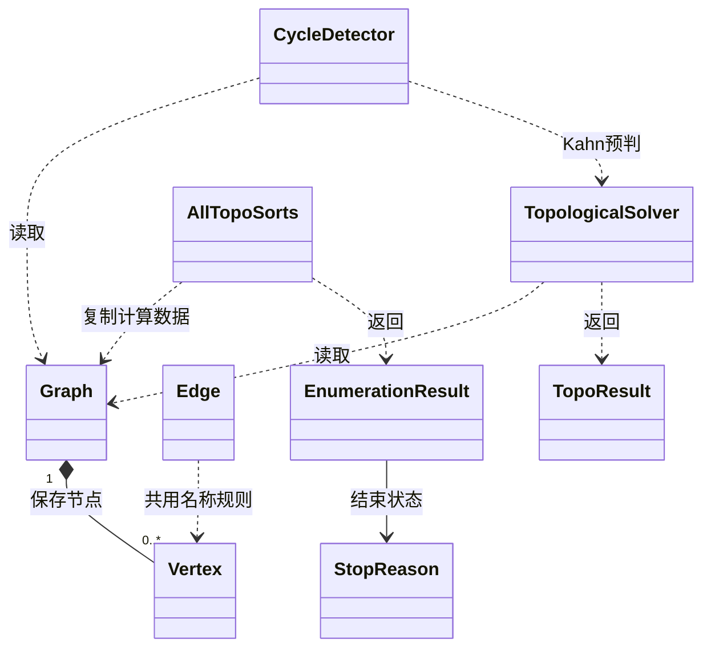
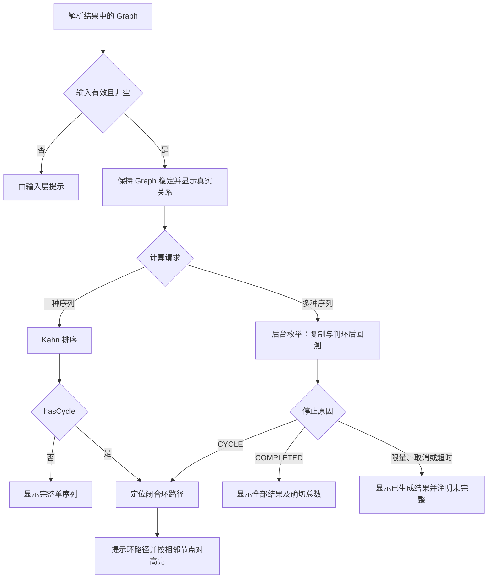

# 项目报告详细设计——A 负责部分

**版本：V0.2 阶段稿；更新日期：2026 年 9 月 19 日；内容责任：A（图结构与核心算法）。**本文根据当前 dev-a 的 model、algorithm 源码及已保存的作者自测记录编写，可整合到项目报告第 3 章。章节编号对应教师模板的 3.1 类设计、3.2 核心流程描述、3.3 核心算法设计，合并时再与 B、C、D 的模块正文统一小节编号；本文不是完整项目报告，也不代替 A7 可行性分析或 A8 概要设计的独立交付。

## 3.1 类设计

### 3.1.1 图模型及职责

系统以有向图表示课程的直接先修关系，边 u→v 表示 u 必须先于 v。model 包保存课程及关系，不保存界面坐标、颜色或算法运行中的入度变化，使同一张图可重复用于排序、环检测和绘图。图允许空图、孤立节点、自环和一般环；是否存在合法拓扑序列由算法判断，不能通过删除不合法依赖让原始数据看起来无环。

| 类 | 主要字段与方法 | 设计说明 |
| --- | --- | --- |
| Vertex | 固定名称 name；successors、predecessors 两个 LinkedHashSet；名称、后继、入度和出度查询 | 保存直接邻接关系，以集合去重并保留插入顺序；关系修改方法限制在 model 包内供 Graph 使用 |
| Edge | 不可变的 from、to；getFrom、getTo、equals、hashCode | 表达一条有方向的边，两个端点及方向共同决定相等性；创建 Edge 不会自动修改任何 Graph |
| Graph | LinkedHashMap<String, Vertex> vertices；edgeCount；增点、增边、删边及查询接口 | 按节点首次录入顺序遍历，统一维护起点后继与终点前驱，防止度数与边关系不同步 |

Graph 不另存可供外部修改的 Edge 集合，绘图和算法通过 getVertexNames 与 getSuccessors 遍历真实关系。Vertex 与 Edge 共用名称处理：String.strip 去除首尾空白、保留内部空格、区分大小写，并拒绝 null、空白名称、代码规定的格式分隔符和换行。解析层对输入分隔符的全角兼容属于 D 的职责，不应与模型直接接收名称的规则混淆。

addEdge 先校验两个名称，再按起点、终点顺序补齐节点，新增关系时同时更新后继、前驱和边数。重复边返回 false，不重复计入度；自环作为一条真实边保存，对该节点的入度和出度各贡献 1。removeEdge 删除关系后保留节点，两端存在但边不存在时返回 false，端点无效或不存在则抛 IllegalArgumentException，避免静默掩盖调用错误。

所有节点列表和后继列表均以 List.copyOf 返回不可修改的独立快照，调用方不能利用列表修改内部关系；图发生变化后应重新查询。Graph 自身仍是可变对象且不保证线程安全，因此整个计算期间由上层保证输入图稳定。查询快照保护的是内部集合访问边界，并不等价于为多个线程提供整张图的一致快照。

### 3.1.2 算法类和结果对象

| 类 | 对外入口或读取方法 | 责任与返回约定 |
| --- | --- | --- |
| TopologicalSolver | kahnSort(Graph) | 生成一种完整拓扑序列；含环时返回空序列及含环状态 |
| TopoResult | getOrder、hasCycle | 保存不可修改的单序列及环状态；空图的序列为空且无环 |
| CycleDetector | findCycle(Graph) | 无环返回空列表，有环返回第一条找到的闭合路径，不保证最短或全部环 |
| AllTopoSorts | enumerate(Graph, int, long, BooleanSupplier) | 在数量、时间和取消约束下枚举不同合法序列，计算不改变输入图 |
| EnumerationResult | getSequences、getGeneratedCount、isComplete、getStopReason | 保存不可修改的外层列表及每条序列，数量与列表大小一致 |
| StopReason | COMPLETED、LIMIT_REACHED、CANCELLED、TIMEOUT、CYCLE | 区分完整结束、限量、取消、超时和含环，供界面及导出保留实际状态 |

这些类全部位于 algorithm 包，三个算法入口均是实例方法。TopoResult、EnumerationResult 由算法构造并交给调用方读取，GUI 不应通过重新拼接结果对象改变完整性含义。TopologicalSolver 和 CycleDetector 的计算状态均为调用内局部变量；AllTopoSorts 持有计时来源，入度、使用标记、路径和结果列表仍逐次调用独立创建。



## 3.2 核心流程描述

### 3.2.1 从输入图到算法结果

输入校验和文件解析由 D 提供，B 从 ParseResult 取得 Graph 后先检查错误及空数据。存在错误时停止计算，没有错误也不意味着图无环；有效的非空图可以先交给 C 绘制真实关系，再按用户操作进行排序或枚举。A 的算法不读取文件、不弹出窗口，也不以排序顺序替代图中的直接边，因而可由 GUI 或独立自测入口复用。



该图说明算法提供的两种计算能力，界面是否提供独立单序列按钮以 B 的最终交互为准。B 当前设计采用先定位环、再后台枚举的流程，A3 在自身入口仍保留判环，保证 E 或其他调用者绕过 GUI 时也能正确结束。A3 的预判使用可取消的局部 Kahn 过程，而非调用没有取消参数的 A2 方法，因此算法原理一致但代码入口不同。

### 3.2.2 调用方式与状态传递

以下片段表达当前 A 接口的调用方式，小图 A→C、B→C 具有两种合法顺序。第一种顺序由稳定队列遍历得到，多序列枚举通过不同零入度选择覆盖两种可能。片段只说明模块调用，不冒充 GUI 已完成联调的证据。

```java
Graph graph = new Graph();
graph.addEdge("A", "C");
graph.addEdge("B", "C");

TopoResult single = new TopologicalSolver().kahnSort(graph);
List<String> cycle = new CycleDetector().findCycle(graph);
EnumerationResult multiple = new AllTopoSorts()
        .enumerate(graph, 1000, 30000, () -> false);
// single.getOrder(): [A, B, C]
// cycle: []
// multiple.getSequences(): [[A, B, C], [B, A, C]]
// multiple.isComplete(): true
```

A5 约定调用方默认传入 1000 条，0 表示不限数量，时间单位为毫秒且 0 表示不限时间。B 已统一配置为 1000 条、30 秒，与契约及需求一致；无全部切换按钮，限量结果必须标记未完整。图引用、取消函数为 null 或限制为负数时，A3 抛参数异常，由调用边界转换成提示或测试失败。

| 场景 | 算法输出 | 上层应表达的内容 |
| --- | --- | --- |
| 正常穷尽 | COMPLETED，完整为 true | 已生成全部合法序列，可报告确切总数 |
| 非空图达到上限 | LIMIT_REACHED，完整为 false | 只确认已生成数量；即使恰好等于真实总数也可能尚未证明穷尽 |
| 取消或超时 | CANCELLED 或 TIMEOUT，完整为 false | 保留此前完整序列，不保留尚未完成的路径 |
| 图含环 | CYCLE，数量 0，完整为 false | 无合法完整拓扑序列，需要定位和说明循环依赖 |
| 算法层空图正常完成 | `[[]]`，数量 1，COMPLETED | 数学意义上有一个空序列；GUI 仍可先提示无数据 |

### 3.2.3 图保护与后台计算

所有算法只读取 Graph，入度减少、节点使用和 DFS 访问状态都保存在局部变量中。A3 先复制计算需要的节点与邻接结构，之后中断或回调异常也不会污染输入图；调用方仍应遵守整个计算期间保持原图稳定的契约。结果对象保存已完成的序列快照，后续回溯或再次调用不会改变已返回内容。

GUI 后台调度、取消按钮和完成回调由 B 组织，算法只通过 BooleanSupplier 检查取消。界面应在算法返回后保留部分结果并展示对应原因，同时避免旧任务覆盖新输入或新任务。A3 的时间限制是协作式检查，不能强行打断正在执行的回调或集合复制，因此不应把 30 秒配置描述为严格到时立即结束的硬实时保证。

## 3.3 核心算法设计

### 3.3.1 Kahn 基础拓扑排序（A2）

Kahn 算法维护尚未处理子图中各节点的剩余入度。首先按录入顺序将所有零入度节点加入先进先出队列，每次取出一个节点追加到输出，并将其直接后继的局部入度减一；后继变为零时入队。整个过程不删除 Graph 中的边，因而不会影响随后绘图或再次计算。

```text
复制全部节点的初始入度到 degree
按录入顺序把 degree 为 0 的节点放入队列 Q
while Q 非空:
    u = Q 队首出队
    将 u 加入 order
    对 u 的每个直接后继 v:
        degree[v] -= 1
        若 degree[v] == 0，则 v 入队
若 order 的节点数等于 V，返回 order 和 hasCycle=false
否则返回空列表和 hasCycle=true
```

每次取出的节点都没有未处理前驱，所以追加它不会违反已有依赖，所有节点处理完后得到合法拓扑序列。如果仍有节点但队列为空，则剩余每个节点都有前驱，在有限图中持续沿前驱追溯必然遇到重复节点，说明存在环。含环时丢弃局部已处理序列，防止将只覆盖部分节点的顺序当成完整答案；空图返回空序列且无环。

每个节点入队、出队各一次，每条边更新一次局部入度，时间复杂度 O(V+E)，辅助空间 O(V)。这里忽略名称长度并按哈希表平均复杂度计；队列遵循录入顺序，因此同一图的遍历顺序不变时结果可复现，但不保证字典序最小。正确性检查应验证节点覆盖与每条边的先后关系，而非只与某个固定字符串比较。

### 3.3.2 环检测与路径定位（A4）

CycleDetector 先调用 Kahn 判断是否含环，无环则立即返回空列表。确认含环后，使用三色 DFS 定位路径：未访问为白色，当前搜索路径中的节点为灰色，已完成探索的节点为黑色。实现以显式迭代器栈代替递归，另用 path 保存当前搜索路径，使长链不会消耗同等深度的 Java 调用栈。

```text
若 Kahn 判为无环，返回空列表
对每个尚未访问的根节点:
    标灰，将根加入 path，将其后继迭代器压栈
    while 栈非空:
        若栈顶没有未检查的后继:
            弹栈，将 path 尾节点移除并标黑
        否则取下一个后继 v:
            若 v 为白色，标灰、追加 path，并压入 v 的后继迭代器
            若 v 为灰色，截取 path 从 v 开始的后缀，再追加 v，返回
            若 v 为黑色，继续检查其他后继
```

灰色节点属于当前活跃路径，指向灰色祖先的边与路径后缀共同构成闭合环；指向黑色节点仅表示到达已完成分支，不能据此判环。例如搜索路径为 X→A→B→C，发现 C→A 时仅返回 [A,B,C,A]，不包含进入环前的 X。自环直接形成 [A,A]，不连通图通过逐个根节点启动搜索覆盖全部分量。

Kahn 预判和 DFS 均为 O(V+E)，组合后时间复杂度仍为 O(V+E)。当前显式栈保存 Graph 返回的后继快照，辅助空间上界为 O(V+E)，不能简单写成仅 O(V)。算法在找到第一条环后结束；若 Kahn 判有环但 DFS 未找到，抛出状态异常提示检查图是否在计算期间被修改，而非伪造路径。

### 3.3.3 多序列枚举初版（A3）

枚举将 Kahn 的“选择一个零入度节点”扩展为“逐一尝试全部当前可选节点”。预处理按录入顺序将名称映射为整数下标，复制后继数组及入度，并先执行带取消、超时检查的 Kahn 判环。含环则直接返回 CYCLE，不因图中还有大量孤立节点而先尝试它们的全部排列。

显式回溯维护 used、order、inDegrees 和 nextCandidate 四组局部数组，depth 表示当前路径长度。nextCandidate 记录每层下次尝试的位置，进入下一层时从头扫描，回到父层后继续父层剩余候选。选择未使用且入度为零的节点后标记使用、写入路径并减少后继入度，撤销选择时执行相反操作。

```text
校验参数，启动单调时钟，建立局部节点/邻接/入度副本
预处理及搜索期间反复检查取消和超时
用另一份入度执行 Kahn；含环则返回 CYCLE
空图正常结束时返回一个空序列
depth = 0
while depth >= 0:
    若取消或超时，返回此前完整结果及对应原因
    若 depth == V:
        复制当前路径保存为结果
        若达到数量上限，返回 LIMIT_REACHED
        回退一层，撤销该层已选节点
    否则从 nextCandidate[depth] 继续寻找未使用的零入度节点:
        找到：选择节点、减少后继入度、进入下一层
        未找到：回退到父层并撤销父层选择
搜索全部退出后返回 COMPLETED
```

选择零入度节点保证每个前缀不违反前驱约束，完整路径包含每个节点一次，因此输出合法。对于任意合法拓扑序列，其下一个节点在相应前缀后必然满足未使用且入度为零，穷尽候选即可覆盖该序列；不同选择路径对应不同节点排列，所以不会生成重复序列。上述完整性论证以搜索穷尽为前提，限量、取消或超时只能保证已返回结果合法，不能保证没有遗漏。

预处理时间 O(V+E)。设 P 为实际访问的搜索状态数、R 为已输出序列数，初版逐层扫描至多 V 个候选，时间上界为 O(V+E+PV+RV)，空间 O(V+E+RV)，其中 RV 为保存返回结果的空间。无边图有 V! 种结果，显式回溯只解决调用栈深度问题，并未消除结果规模爆炸；不限数量时仍可能耗尽时间或内存，后续优化应由实际测试决定。

## 整合时使用的验证依据与当前边界

本文实现说明对应仓库的 `src/model/` 与 `src/algorithm/`，验证事实引用 `docs/验证/A1图结构验证记录.md`、`docs/验证/A2基础拓扑排序验证记录.md`、`docs/验证/A3多序列枚举初版验证记录.md`、`docs/验证/A4环检测及路径定位验证记录.md` 及对应输出。本轮是文档修订，没有重新运行算法测试；A1/A2/A4/A3 已保存的作者自测分别为 16/19/19/25 组通过，不能替代 D/E 的正式测试章节和跨模块联调。

图 1 文件含 15 个节点、16 条边，SHA-256 为 `9A03F2F10ACF96808708BCDE1BFD3F50C66D79556B37156A2F18F597AB211137`。A3 记录完整生成 31,185 条序列，与独立子集动态规划计数一致，并逐条核对覆盖、边约束和唯一性；单次 enumerate 调用耗时 50.863 ms，不含之后验证和写文件。这一结果可作为第 5 章的作者自测素材，但不代表任意输入性能、完整 GUI 响应或 D 正式导出已通过验证。

本次状态更新依据 A 的 `ecc5c277`、B 的 `6cc1708a` 与 D 的 `13f7a9b7`。9 月 19 日已核对 B 的实例调用、默认 1000 条／30 秒、图 1 节选及自环口径；此前指出的 README 示例和解析接口旧文案也已修正。E 已开始独立测试，结果尚待提供。

9 月 19 日，D 的正式解析器与 A 模型、算法在固定版本上完成试接：解析器 35 项、预检 39 项、专门试接检查 43 项均通过；U+2003 名称处理、制表符重复键碰撞及首尾 Unicode 行分隔符漏检均已回归。任务书原始图 1 的 15 个节点和 16 条连线与正式输入逐项对应；原图没有箭头，方向沿用团队“先修到后修”及图中由下向上的解释，不据此虚构教师额外方向说明。正式解析后 Kahn 结果合法，完整枚举 31,185 条，COMPLETED、完整标记 true，逐条节点覆盖、边约束、唯一性和原图不变检查通过。

A1、A2、A4 的实现及 A3 初版、作者自测已完成。A3 后续性能评估、GUI 中途取消、C 绘图及完整导出仍待联调和 E 独立测试结果，不写为最终验收完成。本文按 A 的图模型和算法职责编写，其他模块设计由 B、C、D 提供，合稿时统一术语、编号和引用。
