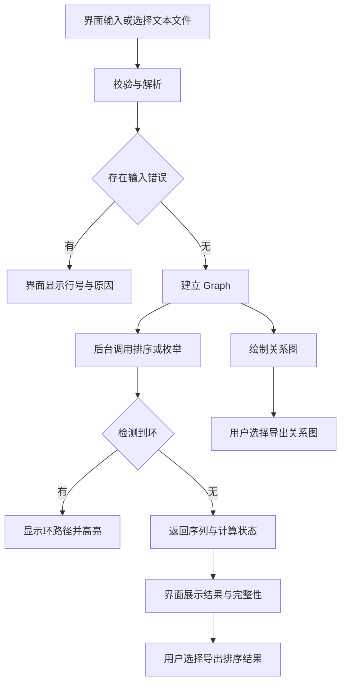

# 拓扑排序应用软件概要设计报告（初稿）

**当前状态：V0.4 阶段稿，2026 年 9 月 19 日更新，尚不是最终稿。**本文包含 A1—A4 当前实现、B 的需求与 GUI 方案，以及最终项目报告的章节分工，本次整理为团队审阅稿。B 的资料读取自 `origin/dev-b` 提交 `0063962`：`docs/需求分析报告.md` 正文 V1.0、`docs/详细设计报告-GUI.md` V1.2；A 的实现以当前 `dev-a` 为依据，两分支尚未在本轮合并或联调。

| 定稿前需要结合的内容 | 需要确认什么 | 对接对象 |
| --- | --- | --- |
| 需求分析 | 已读取 B 报告，本轮先统一默认上限、图 1 节选及自环措辞 | B、A |
| 接口契约与图结构设计 | A5 V1.0 已确认，A1—A4 已实现；核对其他分支实际调用是否遵守实例方法、结果包名和状态语义 | A、B、C、D、E |
| 各模块方案 | 图的读取与高亮、孤立节点输入、导出格式和范围、后台计算与图编辑的关系 | B、C、D、A |
| 运行与验证安排 | JDK 21 已明确；B 已给出 ui.MainFrame 入口，待整合代码后验证编译启动和最终打包 | A、B、E，D 同步使用说明 |

上述设计事项明确后，即可形成正式设计基准，不必等全部代码完成。开发中若实际实现改变了设计，应同步修订；最终提交前再核对设计与软件一致，并整理 Word 和对应 PDF。本文件为供团队审阅的概要设计初稿；项目报告中的实际截图、测试结果和个人总结由后续真实成果提供。

## 一、设计目标与范围

系统以课程之间的直接先修关系为输入，通过统一的图模型完成关系显示、拓扑排序和结果导出。概要设计的重点是明确模块边界与数据流，使成员可以围绕同一套对象和状态实现各自职责。详细算法步骤、类的内部字段和图形布局细节由对应详细设计进一步展开，不在概要设计中重复全部实现代码。

系统提供桌面图形界面，支持手动输入和文本文件导入，并显示关系图及多种合法排序结果。对于格式错误、循环依赖、计算中止和导出失败，系统应提供与实际状态对应的反馈。命令行入口复用同一套解析和算法能力，服务于独立测试与联调，最终使用流程仍包含图形界面。

## 二、总体结构与职责

系统按图模型、算法、输入输出、界面控制、可视化和测试划分职责。Graph 是跨模块传递课程关系的共同对象，解析器负责生成它，算法和绘图读取它，界面组织调用。图模型和算法不依赖 Swing，也不直接访问文件，便于在界面完成前独立开发和验证。

| 模块或包 | 主要类或内容 | 职责 | 主要负责角色 |
| --- | --- | --- | --- |
| model | Vertex、Edge、Graph | 保存课程节点和直接关系，统一修改并提供查询 | A |
| algorithm | TopologicalSolver、AllTopoSorts、CycleDetector 及结果对象 | 单序列排序、多序列枚举、环检测与计算状态 | A |
| io | DataParser、ParseResult、ParseIssue、FileManager | 解析关系、反馈输入问题、读写数据和排序结果 | D |
| ui | 窗口、MainController、后台任务组织 | 接收操作、调用模块、维护界面状态和统一提示 | B |
| view | GraphPanel 及布局绘制实现 | 绘制实际关系、高亮环和导出图片 | C |
| util | InputValidator、ExceptionHandler、UIStyle 等 | 共享校验辅助、界面提示和样式；校验规则与解析器一致 | D、B 按各自任务负责 |
| 测试与命令行入口 | AlgorithmRunner、测试数据和验证代码 | 在无界面条件下调用解析与算法，保存真实验证记录 | E，各模块先自测 |

上述类名结合正式接口契约与 B 分支文件组织。A 的 TopoResult、EnumerationResult、StopReason 均位于 algorithm 包；B 文档将流程图中的 EnumerationResult 写成 io 包，整合时应修正。B 分支存在界面、解析和画布代码，但其文档将解析器称为契约桩、画布称为阶段实现，本文不据此宣布 D、C 正式任务已验收；公共职责仍按团队分工执行，B 直接使用 ParseResult 中的 Graph，不重复建图。

## 三、系统数据流

输入文本先经过 D 的校验与解析，形成包含 Graph、错误和警告的结果。B 检查结果是否允许继续，有错误则显示原因；有效数据交给 C 绘图，并在用户请求时交给 A 的算法计算。结果回到 B 后用于显示，用户再选择由 D 导出排序文本或由 C 导出关系图。

图中的“建立 Graph”表示采用解析结果中的图，并不是让界面再建一张图。单序列排序可以用 Kahn 的处理计数判断环，多序列枚举应在展开搜索前检查环；具体模块可复用判环能力，不要求为每一步重复完整计算。含环输入仍可以绘图以解释问题，但不能显示为存在合法完整拓扑排序。

## 四、主要数据对象

### 1. 图模型

Vertex 保存名称以及直接前驱、后继名称集合，Edge 表示有方向的一对端点，Graph 维护名称到 Vertex 的映射及边数。当前方案保留首次插入顺序，重复关系不重复计数，入度与出度分别从前驱和后继集合大小取得。更完整的存储说明、方法表和示例见开发文档中的[图数据结构设计](设计/图数据结构设计.md)。

当前名称方案采用去除首尾空白、保留内部空格并区分大小写，例如 CS 225 是一个完整名称。关系 a → b 表示 a 必须先于 b，Graph 支持没有连边的独立节点，也保留自环供算法报告。添加、删除和查询的边界行为与接口契约一致，公开前驱查询方法尚未纳入当前基准，不因内部保存前驱集合而自动增加接口。

### 2. 解析结果

按正式契约，ParseResult 提供 Graph、错误列表与警告列表，ParseIssue 描述行号和原因。存在错误时，控制器不启动计算，也不将解析过程产生的部分图当成完整有效输入。B 文档记录了当前解析桩的接入方式，但 D 正式版本仍需核对，不能把 B 文档中的桩来源或通过记录当作本轮已验证事实。

### 3. 单序列与环路径

TopoResult 已实现完整排序序列与 hasCycle 状态，无环时序列覆盖每个节点一次。含环时返回空序列和 true，避免混入部分结果；空图返回空序列和 false，输入层仍应提示没有有效数据。CycleDetector 已返回不可修改的闭合节点序列，例如 [A,B,C,A]，无环返回空列表，自环返回 [A,A]；它定位遇到的第一条环，不保证最短环，也不枚举所有环。

### 4. 多序列结果

EnumerationResult 已实现序列、生成数量、完整标记及停止原因，外层列表和每条序列均不可修改，不引用回溯中的工作数组。生成数量从返回序列数取得，只有确认搜索穷尽时才能作为合法序列的确切总数。取消和超时保留此前已经完成的序列，未完成的路径不作为结果返回。

| 停止原因 | 系统应表达的含义 | 显示与导出要求 |
| --- | --- | --- |
| COMPLETED | 搜索已穷尽 | 可报告全部结果及确切总数 |
| LIMIT_REACHED | 已到数量上限，尚未证明穷尽 | 标记部分结果，显示已生成数量 |
| CANCELLED | 收到取消请求并结束计算 | 说明用户取消，已有结果按约定保留 |
| TIMEOUT | 达到运行时间限制 | 说明超时，不把已有数量当总数 |
| CYCLE | 输入存在循环依赖 | 说明无合法拓扑序列，与成功枚举区分 |

## 五、模块接口与调用约束

下表概括 A5 V1.0 正式接口中的主要调用，完整参数和行为以团队仓库的 `docs/接口契约.md` 为共同依据。A 的三个算法入口均为实例方法，例如 `new CycleDetector().findCycle(graph)` 与 `new AllTopoSorts().enumerate(...)`。B 当前 MainController 使用类名直接调用这两项，与 A 当前实现不一致；整合前应由对应负责人对齐，不能因各分支分别能编译就推断组合后能编译。

| 调用 | 发起方与实现方 | 主要约束 |
| --- | --- | --- |
| Graph 的 addVertex、addEdge、removeEdge 及查询方法 | D、算法、绘图或测试调用，A 实现 | 统一关系方向、名称规则、重复边和查询保护 |
| DataParser.parse(String text) | B 或 E 调用，D 实现 | 返回 ParseResult，输入校验使用同一套格式规则 |
| TopologicalSolver.kahnSort(Graph graph) | B 或 E 调用，A 实现 | 不修改原图，返回完整顺序或含环状态 |
| CycleDetector.findCycle(Graph graph) | 控制流程或算法调用，A 实现 | 环路径中每一条相邻关系都实际存在 |
| AllTopoSorts.enumerate(Graph graph, int maxResults, long timeoutMillis, BooleanSupplier cancelled) | B 或 E 调用，A 实现 | 先判环，响应限制和取消，准确报告完整性 |
| GraphPanel.setGraph(Graph graph) | B 调用，C 实现 | 读取真实图关系，不将排序结果擅自连成原图边 |
| GraphPanel.setHighlightedCycle(List<String> closedCycle) | B 调用，C 实现 | 以闭合路径的相邻节点对确定高亮边 |
| GraphPanel.exportPNG(File file) | B 组织操作，C 实现 | 按契约导出完整关系图，含视口外内容；写入失败传回调用边界 |
| 排序结果文件导出 | B 组织操作，D 实现 | 具体方法由 B、D 对接，保留序列及状态信息 |

Graph 当前查询返回不可修改的独立快照，图变更后旧列表不会自动刷新。removeEdge 在端点无效或不存在时抛 IllegalArgumentException；两端存在但边不存在时返回 false，成功删除后仍保留节点。底层异常由调用边界转换为用户提示或测试失败，不在模型和算法里弹出窗口；Graph 不保证线程安全，调用方须在整个计算期间保持输入图稳定。

## 六、主要运行流程

### 1. 输入、校验与建图

用户在输入区域粘贴关系文本，或选择文本文件由输入输出模块读取。解析器跳过约定的空行和注释，检查每条关系的分隔符及名称，再调用 Graph 添加关系；例如 `<MA 141,CS 225>` 对应 `addEdge("MA 141", "CS 225")`。解析完成后由 B 判断错误状态，有效图进入后续流程，存在错误时先显示问题，不启动排序。

输入层提示整份文本没有有效数据，与 Graph 允许为空并不矛盾。重复关系可以去重并反馈警告，自环保留在图中交由环检测解释。孤立节点虽然能通过 Graph.addVertex 保存，但其文件或界面录入办法尚未确定，应在实现相关输入功能前补齐约定。

### 2. 关系图展示与环提示

C 先读取全部节点，再遍历各节点的直接后继以画出全部真实边，因此没有连边的节点也不会被遗漏。坐标、颜色、缩放和选中状态由可视化模块维护，不能写进算法的入度或访问标记。新数据载入时清理旧图对应的结果与高亮，避免旧状态被误认为属于新图。

检测到环时，B 将闭合路径转换成可读提示，并交给 C 高亮相应节点与边。高亮的边必须是环路径中连续出现的节点对，不能将这些节点之间所有可能的边一并标红。图形布局如何组织含环图以及选中排序序列的展示方式，由 B、C 在各自设计中补充。

### 3. 一种合法排序

Kahn 排序先读取全部节点和初始入度，创建局部入度表，再选择入度为零的节点逐个处理。每处理一个节点，只减少局部表中其后继的入度，不删除 Graph 中的原始边。若最终输出覆盖全图则返回合法顺序，否则返回含环状态，由环路径检测补充解释。

同一图可能有多种正确顺序，所以验证不能只与一个固定字符串相等比较。应检查每个节点恰好出现一次，并且所有边的起点都排在终点之前。稳定遍历顺序有助于复现一次运行的选择，但不意味着其他合法序列是错误答案。

### 4. 多序列枚举

枚举先复制节点、后继和入度，以可检查取消和超时的局部 Kahn 过程判环，再通过显式回溯尝试不同零入度选择。每层记录下一候选位置，选择节点后减少其后继入度，退回上一层时恢复；形成完整路径后复制保存。A3 不依赖递归调用栈，回溯恢复、取消和异常退出均不改变原始 Graph，已返回的序列不随后续探索变化。

正式契约中 maxResults 默认由调用方传 1000，0 表示不设数量上限；timeoutMillis 为 0 表示不设时间限制。B 需求 §3.2、GUI 设计和代码采用 10000 条、30000 ms，而需求附录 Q-2 仍写 1000，需 A、B 统一默认值；目前不擅自修改契约。负数限制、graph 为 null 或取消函数为 null 会被拒绝；空图正常完成返回一个空序列 `[[]]`、数量 1、COMPLETED，输入层的空数据提示是另一层职责。

非空图恰好达到数量上限但尚未证明穷尽时，A3 保守返回 LIMIT_REACHED 和未完整，即使上限恰好等于实际总数。计时使用 System.nanoTime，覆盖复制、判环和搜索，取消与超时采用协作式检查，并非硬实时中断。GUI 和导出必须保留这些状态，不能将“已生成数量”统一称为“总数”。

### 5. 后台计算、取消与数据一致性

B 的设计已采用 SwingWorker 启动后台枚举、调整计算与取消按钮状态，并通过 done 更新显示。A3 在计算过程中检查取消和超时，返回已有完整序列与停止原因；本轮仅核对了相关源代码，没有实际运行 GUI。取消是否能正确取回部分结果、任务完成是否早于清理状态，以及旧任务是否会覆盖新数据，均需在与 A 实际算法接入后验证。

后台任务必须读取稳定的图，可在计算期间禁止修改同一 Graph，或为计算提供独立快照；当前两种方案尚未最终选定。仅把入度复制到局部变量，仍无法防止别的模块同时改变节点和邻接关系。选定方案后应明确执行责任，并测试计算、取消、重新输入和再次计算的连续操作。

### 6. 文件导出

用户选择导出后，由 B 取得目标文件并调用相应模块，选择取消时正常结束操作。D 的排序文本需写明序列、生成数量、完整性和停止原因；B 需求已列出 TXT 与 CSV 两种格式，应核对实际导出是否保留上述元数据以及 CSV 转义。C 按正式契约保存完整关系图，包括当前视口外的节点与边，这已经是明确要求，实际导出效果仍需测试。

导出失败应给出实际原因，例如目标无法写入，而不改变原图或清空已计算的结果。输入数据和结果文件均以统一编码处理，包含课程名称的输出应保留名称原样。最终需用重新读取或实际打开文件的方式检查输出内容，不能只以“写入方法未报错”证明导出正确。

## 七、数据存储与样例依据

系统使用 UTF-8 文本文件保存关系数据，一行采用英文半角尖括号和逗号表达 `<先修课程,后修课程>`。名称允许内部空格，解析跳过空行和以 # 开头的注释行；B 需求明确兼容全角尖括号和逗号，由 D 统一解析、校验和半角规范保存。孤立节点额外输入语法仍未明确，不能用自环代替孤立点；B 需求中的自环“不参与排序”应解释为含环图无法给出完整拓扑序列，而非删除自环后继续。

已取得并用于 A 作者自测的 `data/figure1.txt` 包含 15 个节点、16 条边，保留 `MA 141`、`CS 225` 等名称中的内部空格。该文件 SHA-256 为 `9A03F2F10ACF96808708BCDE1BFD3F50C66D79556B37156A2F18F597AB211137`，A3 完整生成 31,185 条序列，与独立子集动态规划总数一致，结果保存在 `docs/A3/all_results.txt`。B 需求 §5.3 的文本节选与此文件及其自身 Mermaid 图不一致，整合时应替换为同一数据版本；算法验证不代替核对任务书原图。

`dev-b` 已有 D 署名的 `data/curriculum.txt`，文件头标注培养方案来源、43 个节点、85 条边及若干课程映射说明。上述规模和来源属于数据文件声明，本轮未重新验证，也未核对培养方案原件。正式报告仍需 D 提供适用年级、原始资料依据和映射说明，并由 E 保存真实运行及导出记录。

数据、源码、测试材料和文档分别放入项目对应目录，图 1 数据使用 `data/figure1.txt`。排序结果与图片的实际导出位置由用户操作选择，测试输出则按团队统一位置保存以便复现；A3 现有结果文件由自测程序写出，并非 D 导出模块的验证成果。当前不引入数据库，数据共享须绑定文件版本，不能用相同文件名推定不同分支内容一致。

## 八、运行环境与部署设计

技术路线为 Java＋Swing，团队目标 JDK 已统一为 21，源码和文本数据采用 UTF-8。B 需求与 GUI 设计给出的源码启动入口为 ui.MainFrame，属于 dev-b 的现有方案，本轮未验证其与 dev-a 算法组合后的运行。开发时各成员需能按统一方式编译和运行，不能依赖某台电脑的绝对路径；完整构建命令由 B、E 在整合后的同一版本上验证并交付。

发布形式可沿用团队方案中的 JAR 及启动脚本，但需要兼容的 Java 运行环境，并由 E 在目标电脑验证。运行说明由 E 整理到正式 readme.txt，D 的用户手册与其保持一致，A 提供模型和算法所需的真实运行信息。最终检查应从交付目录或解压目录启动，确认输入样例、导出路径和错误提示均可复现。

## 九、验证策略与完成标准

模型与算法先使用手工小图自测，再通过同一解析器接入图 1 与真实课程数据。界面和导出完成后，以完整使用流程检查各模块是否传递了相同的图和结果状态。所有表述为“预期”的内容都要与实际运行记录区分，未执行的用例不填成通过。

| 验证对象 | 主要检查 | 完成依据 |
| --- | --- | --- |
| Graph | 孤立点、重复边、自环、增删同步、名称与查询边界 | 模型自测记录，关系和度数符合约定 |
| 单序列排序 | 节点覆盖、无重复、所有边的先后约束 | 小图、图 1 等输入的真实输出与约束检查 |
| 环检测 | 自环、两点环、较长环和无环输入 | 返回路径闭合且对应真实边 |
| 多序列枚举 | 小图集合正确、没有重复、限制和取消生效 | 人工集合对照及完整性、停止原因检查 |
| 解析与数据 | 注释、空行、空名称、重复输入、错误行号 | 正常与异常文件的解析记录 |
| 图形与导出 | 节点和边对应输入，环高亮准确，文件内容完整 | 实际界面和导出文件检查 |
| 连续操作与运行环境 | 取消后重算、切换数据、目标环境启动 | 联调记录及按 readme 复现的结果 |

单序列排序和 DFS 环检测时间为 O(V＋E)，Graph 存储空间为 O(V＋E)；当前 DFS 显式栈保存后继快照，辅助空间上界为 O(V＋E)。枚举初版在 P 个搜索状态中逐层扫描候选并输出 R 条长度为 V 的序列，时间上界可写为 O(V＋E＋PV＋RV)，空间 O(V＋E＋RV)，不能沿用单序列算法的复杂度结论。千节点测试须记录图形、边数、限制、耗时与环境，当前无递归栈风险不代表无结果内存风险。

9 月 18 日已有记录显示 A1/A2/A4/A3 分别通过 16/19/19/25 组作者自测，并通过 JDK 21 严格编译；图 1 全枚举一次调用耗时 50.863 ms。千节点链生成唯一序列耗时 29.1279 ms，千个孤立节点限量 1000 条耗时 104.1797 ms，后者明确未完整。以上均引用已保存的单次作者记录，不是本轮重新测试；性能目标及测试方式留待后续优化和联调共同评估，不作为本轮要求 B 单独确认的事项。

## 十、设计版本与报告衔接

本次保留原概要设计结构，补充实际接口行为、B 分支资料和 A1—A4 验证依据。下一步应统一默认上限与算法调用方式，核对正式解析、取消流程、导出及完整运行证据，再形成一致的设计基准。概要设计无需等待所有实现才开始撰写，但最终交付必须与实际软件一致，当前仍标注阶段稿。

### 1. 三份报告的关系与交付

| 交付物 | A 的责任 | 任务书规定的最终位置与格式 |
| --- | --- | --- |
| 可行性分析报告（A7） | 主笔技术、经济、操作、进度可行性及风险五部分，与 B 需求互相引用 | `04-项目文档/可行性分析报告.doc` ＋对应 PDF |
| 概要设计报告（A8） | 主笔模块划分、数据流、接口表、文本存储和运行部署 | `04-项目文档/概要设计报告.doc` ＋对应 PDF |
| 项目报告（A8 统筹） | 按模板整合八章；补写 A 的图模型和算法内容；统一封面、分工表、修订记录、格式与术语并审校 | `01-项目报告/项目报告.doc` ＋对应 PDF |

因此，A 在项目报告中主要补写自己的详细设计、提供真实算法验证素材，并整合其他成员的成果；但工作不止于粘贴 3.3 一小节。A 的类设计和调用流程也属于 3.1、3.2，还需完成封面等统筹内容、自己的感想，以及审查章节衔接和证据一致性。两份独立报告仍要单独交付，不能用项目报告的详细设计章节替代；任务卡要求 9 月 20 日初稿、9 月 27 日定稿。

### 2. 按最终项目报告模板整合

| 模板章节 | 应纳入的内容 | A 的工作边界 |
| --- | --- | --- |
| 1 软硬件环境 | 最终实际编译、运行和测试环境 | 整合 B/E 的运行信息及 A 的测试环境，区分目标配置和实测配置 |
| 2 需求分析 | B 的需求报告，包括功能、异常与性能口径 | 保留 B 的贡献，统一已发现的需求差异，不把目标写成实测通过 |
| 3.1 类设计 | 模型、算法、GUI、绘图、解析与文件类 | A 写 model/algorithm；B/C/D 提供各自模块素材 |
| 3.2 核心流程描述 | 输入至导出的整体流程及模块衔接 | A 写建图、排序、判环、枚举的数据流与状态约束，结合 B 主控及 C/D 流程整合 |
| 3.3 核心算法设计 | Kahn、环路径定位、全拓扑枚举，以及对应模块的关键算法 | A 写三个图算法与复杂度，绘图布局等由 C 提供 |
| 4 运行结果截图 | 图 1、课程数据、正常及异常操作的实际界面 | 收集 B/C 等实际运行素材，配套说明；不能用算法控制台代替 GUI 截图 |
| 5 测试 | 测试用例、预期、实际结果、性能条件与问题 | D 主笔、E 提供执行记录；A 补充作者自测，明确两类测试的区别 |
| 6 系统特色以及可扩展点 | 已实现特点与尚未实现的扩展设想分别说明 | 汇总各模块，A 可写稳定遍历、原图保护、显式栈与完整性状态，不宣称未测性能优势 |
| 7 感想 | 成员真实承担的工作、收获和不足 | A 写本人内容并收集其他成员内容，不代写或虚构个人经历 |
| 8 附件（会议记录） | 实际会议记录及要求的附件 | 收集 E 整理的真实记录，核对时间、参与者和决议，不补造会议 |

封面、分工表和修订记录作为报告前置材料统一整理，分工表应有五人姓名、学号、职责与主要工作。组别、专业、指导教师等按真实信息和模板填写，不由助手猜测。成员章节并非直接拼接即可完成，A 还要检查术语、接口、数据版本、截图、测试结论和版本记录相互一致。

A 的图结构与核心算法详细设计将按 3.1—3.3 编排后另行整合进项目报告，本次先提供概要设计供团队审阅。本文与可行性分析仍是 Markdown 阶段稿，最终需要按要求形成真实 Word 与 PDF 文件；完整项目报告需在收齐各成员材料后整合、审校。

| 版本 | 日期 | 修改内容 |
| --- | --- | --- |
| V0.2 | 2026-09-17 | 从提纲扩写系统概要设计初稿 |
| V0.3 | 2026-09-18 | 对齐 A 当前实现和 B 需求，记录跨分支差异，补充最终八章整合职责及三份报告交付关系 |
| V0.4 | 2026-09-19 | 整理团队审阅稿；本轮需求对接聚焦三个问题，性能留待后续优化和联调评估 |
