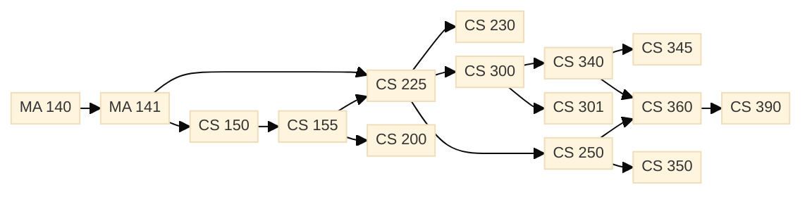
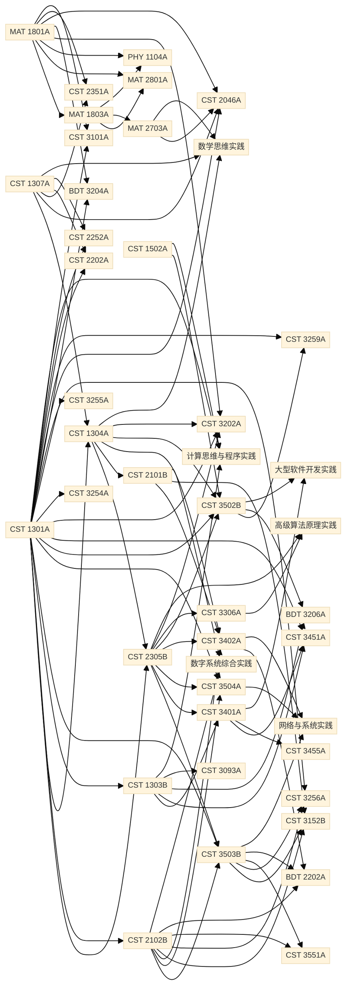

# 拓扑排序应用软件 需求分析报告

本报告由组员 B 编写，对应 GUI 主框架与交互控制模块的需求分析，文档版本 V1.0，编写日期 2026 年 9 月 17 日。报告以任务书和《拓扑排序项目-团队任务执行方案》为依据，明确软件应具备的功能、性能与边界行为，作为概要设计与详细设计的输入，并与 9 月 17 日冻结的跨模块接口契约保持一致。

## 一、引言

### 1.1 编写目的

本文档对"拓扑排序应用软件"项目进行需求分析，明确系统应具备的功能、性能与边界行为，作为后续概要设计与详细设计的依据。任务书要求软件以图形界面方式接收"先修→后修"关系数据，输出尽可能多的拓扑排序结果，并支持关系图与结果的导出。

### 1.2 项目背景

拓扑排序是离散数学与算法设计中的典型问题，广泛应用于课程先修关系、任务调度、配件组装等场景。本项目要求实现一个桌面（非网页）应用软件，对一组具有先后依赖关系的有向无环图（DAG）进行拓扑排序并可视化展示。

### 1.3 术语与缩写

| 术语 | 含义 |
|---|---|
| DAG | 有向无环图（Directed Acyclic Graph） |
| 拓扑排序 | 对 DAG 顶点进行线性排序，使对每条边 (u,v)，u 在 v 之前 |
| Kahn 算法 | 入度队列法拓扑排序，时间复杂度 O(V+E) |
| 自环 | 起点 = 终点的边，如 `<a,a>` |
| `<a,b>` | 表示一条由 a 指向 b 的有向边 |

### 1.4 参考资料

- 2026 年 高级算法原理实践 指导书（任务书）
- 《拓扑排序项目-团队任务执行方案》V1.1
- 课程教材：数据结构、算法设计与分析

---

## 二、功能需求

本节覆盖任务书"系统功能性需求"全部 7 条，以用例表形式描述。

### 2.1 功能需求总览

<table>
<colgroup><col style="width:60px"><col style="width:40%"><col style="width:45%"><col style="width:80px"></colgroup>
<thead><tr><th>编号</th><th>任务书需求</th><th>实现要点</th><th>责任模块</th></tr></thead>
<tbody>
<tr><td>FR-1</td><td>图形界面输入关系，显示关系图，运行后给出尽可能多的拓扑排序结果</td><td>输入面板 + 关系图绘制 + 全拓扑枚举</td><td>B / C / A</td></tr>
<tr><td>FR-2</td><td>良好的功能操作界面（菜单、工具栏、编辑区）</td><td>主窗口 + 菜单栏 + 工具栏 + 状态栏</td><td>B</td></tr>
<tr><td>FR-3</td><td>数据输入和导入，关系图及拓扑排序结果导出</td><td>文件载入 + 数据保存 + PNG 导出 + TXT/CSV 导出</td><td>B / D / C</td></tr>
<tr><td>FR-4</td><td>统一数据输入格式 <code>&lt;a,b&gt;</code>，一行一条关系</td><td>解析器 + 格式说明</td><td>D</td></tr>
<tr><td>FR-5</td><td>先用图一例子测试软件运算是否正确</td><td>figure1.txt 数据集</td><td>D / E</td></tr>
<tr><td>FR-6</td><td>利用学业指南整理计算机系课程先修关系，绘制关系图并导出结果</td><td>curriculum.txt 数据集</td><td>D / E</td></tr>
<tr><td>FR-7</td><td>软件应考虑突发情况与不确定情况</td><td>非法输入/重复边/自环/含环图/空数据/大图处理</td><td>A / D / B</td></tr>
</tbody>
</table>

### 2.2 用例表

#### 用例 UC-01：图形界面输入关系并显示关系图

| 项 | 内容 |
|---|---|
| 参与者 | 用户 |
| 前置条件 | 软件已启动 |
| 主流程 | 1. 用户在输入面板文本区输入 `<a,b>` 关系数据；2. 点击"计算"按钮；3. 系统校验并解析数据；4. 系统建立图数据结构；5. 系统在右侧画布绘制节点与有向边；6. 系统在结果面板列出拓扑排序结果 |
| 异常流 | 数据格式错误：弹窗提示行号与原因；含环：画布高亮环路径并提示 |
| 后置条件 | 关系图与拓扑排序结果已展示在界面上 |

#### 用例 UC-02：良好的功能操作界面

| 项 | 内容 |
|---|---|
| 参与者 | 用户 |
| 前置条件 | 软件已启动 |
| 主流程 | 1. 主窗口顶部显示菜单栏（文件/编辑/计算/帮助）；2. 菜单栏下方显示工具栏（打开/保存/计算/导出图片/导出结果）；3. 主内容区分左右两栏（左输入、右图形+结果）；4. 底部显示状态栏（节点数/边数/含环/序列总数/耗时） |
| 后置条件 | 用户可通过菜单或工具栏触发全部功能 |

#### 用例 UC-03：数据输入和导入、关系图及结果导出

| 项 | 内容 |
|---|---|
| 参与者 | 用户 |
| 前置条件 | 软件已启动 |
| 主流程 | 1. 用户点击"载入文件"按钮，选择 .txt 文件载入 `<a,b>` 数据；2. 用户编辑后点击"保存数据"导出为文本；3. 用户计算后点击"导出图片"将画布保存为 PNG；4. 用户点击"导出结果"，选择 TXT 或 CSV 格式保存拓扑排序结果 |
| 异常流 | 文件不存在或权限不足：弹窗提示 |
| 后置条件 | 数据与结果已落盘 |

#### 用例 UC-04：统一数据输入格式 `<a,b>`

| 项 | 内容 |
|---|---|
| 参与者 | 用户 |
| 前置条件 | 输入区有内容 |
| 主流程 | 1. 用户按 `<起,终>` 格式每行输入一条关系；2. 西文尖括号 `< >` 与西文逗号 `,`；3. 空行与 `#` 开头注释行被忽略；4. 全角尖括号 `＜＞` 与全角逗号 `，` 兼容；5. 重复边自动去重 |
| 异常流 | 缺少尖括号或逗号：弹窗标红对应行 |
| 后置条件 | 数据按规范解析为边列表 |

#### 用例 UC-05：图一示例验证

| 项 | 内容 |
|---|---|
| 参与者 | 用户 |
| 前置条件 | 载入 `figure1.txt`（任务书图 1 课程先修关系，15 门课程） |
| 主流程 | 1. 用户载入数据；2. 点击"计算"；3. 系统绘制关系图并输出拓扑排序；4. 用户核对结果与人工比对一致 |
| 后置条件 | 软件运算正确性得到验证 |

#### 用例 UC-06：计算机系课程先修关系整理与导出

| 项 | 内容 |
|---|---|
| 参与者 | 用户 |
| 前置条件 | 已整理 `curriculum.txt`（≥30 节点） |
| 主流程 | 1. 载入课程数据；2. 点击"计算"；3. 系统绘制全系课程关系图；4. 用户导出关系图 PNG 与拓扑排序结果 |
| 后置条件 | 计算机系课程先修关系与拓扑序已导出 |

#### 用例 UC-07：突发情况与不确定情况处理

| 项 | 内容 |
|---|---|
| 参与者 | 用户 |
| 前置条件 | 用户构造异常输入 |
| 主流程 | 系统应能识别并友好提示以下场景：①非法输入（缺括号/缺逗号/乱码行）；②重复边；③自环 `<a,a>`；④含环图（A→B→C→A）；⑤空数据；⑥全部孤立节点；⑦大图（千节点随机 DAG） |
| 异常流 | 不崩溃；弹窗中文提示 + 行号定位；含环图自动高亮环路径 |
| 后置条件 | 用户得到清晰错误反馈，可继续修正输入 |

---

## 三、非功能需求

### 3.1 运行平台与开发环境

| 项 | 要求 |
|---|---|
| 运行平台 | Windows / Linux / macOS 任意支持 JDK 21 的平台 |
| 开发工具 | IntelliJ IDEA / Eclipse / VS Code + Java 插件 |
| 开发语言 | Java（JDK 21，Swing GUI 框架，零外部依赖） |
| 数据存储 | 文本文件（.txt / .csv） |
| 部署方式 | 当前阶段源码编译运行（入口 `ui.MainFrame`）；可执行 jar 与启动脚本为组员 E 的后续交付项（里程碑 09-27） |

### 3.2 性能需求

| 指标 | 目标 |
|---|---|
| 千节点 DAG 计算 | 1 秒内完成 Kahn 排序 |
| 全拓扑枚举 | B 调用配置上限 10000 条、超时 30 秒（契约 §4：`maxResults` 由调用方传入，0 表示不限）；千节点图不卡死 |
| GUI 响应 | 全拓扑枚举在 SwingWorker 后台线程执行，不阻塞 EDT；提供取消按钮，按钮状态互斥 |
| 内存占用 | 千节点图 < 256 MB |

### 3.3 可用性与可靠性

- 全程中文提示，错误信息含行号定位；
- 异常情况不崩溃，弹窗告知原因；
- 接口契约冻结（9.17）后不得擅自变更签名；
- 状态栏实时反馈当前图与计算状态。

### 3.4 可维护性与编码规范

- 面向对象设计，包结构与代码规范一致：`model`（图模型）/ `algorithm`（排序、枚举、环检测）/ `io`（解析与文件读写）/ `view`（关系图绘制）/ `ui`（Swing 界面与调度）/ `util`（样式与异常处理）；
- 类与方法均含 Javadoc 注释；
- 命名采用驼峰命名法；
- Git 分支管理，每人一分支，合并前组长 Review。

---

## 四、运行环境

### 4.1 软件环境

- JDK 21（团队统一目标版本，见代码规范与接口契约 §8）；
- 操作系统：Windows 10/11、Ubuntu 20.04+、macOS 11+；
- 无需额外第三方库（仅用 JDK 标准库：Swing、AWT、NIO）。

### 4.2 硬件环境

- CPU：x86-64，主频 ≥ 1.6 GHz；
- 内存：≥ 2 GB（千节点图建议 ≥ 4 GB）；
- 显示器：≥ 1366×768。

### 4.3 部署方式

当前阶段以源码方式运行，源码唯一根目录为仓库内 `src/`，入口为 `ui.MainFrame`：

```powershell
# Windows PowerShell：递归编译，必须显式指定 UTF-8
Set-Location src
$files = (Get-ChildItem -Recurse -Filter "*.java" |
          Where-Object { $_.Name -ne "package-info.java" }).FullName
& javac @('-encoding','UTF-8','-d','out') @files

Set-Location out
java ui.MainFrame
```

可执行 jar 包与 `run.bat` / `run.sh` 启动脚本属于组员 E 的打包交付项（里程碑 09-27），本阶段不提供，亦不以 jar 方式启动。

---

## 五、数据需求

### 5.1 输入数据格式

任务书统一规定数据输入格式如下：

```
# 一行定义一条关系，西文尖括号
<a,b>
<c,d>
<a,c>
...
```

**规则**：

1. 每行一条有向边，格式 `<起点,终点>`；
2. 必须使用西文尖括号 `< >` 与西文逗号 `,`；
3. 兼容全角 `＜＞` 与 `，`；
4. 行首尾空格被自动忽略；
5. 空行被跳过；
6. `#` 开头的行为注释，被跳过；
7. 重复边自动去重；
8. 自环 `<a,a>` 被识别并标记，不参与拓扑排序。

### 5.2 输出数据格式

| 类型 | 格式 |
|---|---|
| 关系图导出 | PNG 图片，含背景、节点、有向边、图例 |
| 拓扑排序结果（TXT） | 每条序列一行，带序号，节点以 ` -> ` 连接：`1. a -> c -> b` |
| 拓扑排序结果（CSV） | 每条序列一行，节点以英文逗号分隔：`a,c,b` |

### 5.3 数据文件示例

`figure1.txt`（任务书图 1 课程先修关系，节选）：

```
# 课程先修关系（节选）
<CS150,CS155>
<CS155,CS225>
<CS200,CS225>
<MA140,MA141>
<MA141,CS250>
...
```

完整数据渲染为 Mermaid 有向图（15 节点 / 16 边，箭头方向为先修 → 后修，在 GitHub 中直接显示）：



`curriculum.txt`（计算机系全部课程先修关系，43 节点 / 85 边）：

```
# 计算机系课程先修后修关系
<程设基础,数据结构>
<数据结构,算法设计与分析>
<离散数学,算法设计与分析>
...
```

完整培养方案关系渲染为 Mermaid 有向图（节点编号按数据文件中首次出现顺序分配；图较密集，可在 GitHub 中放大查看）：



---

## 六、需求追踪矩阵

| 任务书要求 | 对应用例 | 实现模块 |
|---|---|---|
| 图形界面输入关系并显示关系图 | UC-01 | InputPanel / GraphPanel / MainController |
| 良好的功能操作界面 | UC-02 | MainFrame / UIStyle / StatusBar |
| 数据输入和导入、结果导出 | UC-03 | FileManager / MainController |
| 统一数据输入格式 `<a,b>` | UC-04 | DataParser / InputValidator |
| 图一示例验证 | UC-05 | figure1.txt / 测试用例 |
| 全系课程关系整理与导出 | UC-06 | curriculum.txt / 测试用例 |
| 突发情况处理 | UC-07 | CycleDetector / ExceptionHandler / GraphPanel |

---

## 七、附录

### 7.1 假设与依赖

- 假设用户具备基本计算机操作能力；
- 依赖 JDK 21 运行环境正确安装；
- 依赖组员 A 提供 `Graph / TopologicalSolver / AllTopoSorts / CycleDetector` 的最终实现，并冻结跨模块接口契约 V1.0；
- 依赖组员 C 提供 GraphPanel 的最终实现（含分层/环形布局与交互）；
- 解析层已接入组员 D 交付的正式实现（`io.DataParser.parse(String)` 实例方法 + 顶层 `io.ParseResult` / `io.ParseIssue`，`ParseIssue` 公开方法为 `getLineNumber/getMessage/getContent`）；数据集 `figure1.txt` 与 `curriculum.txt` 由组员 D 提供。

### 7.2 待确认问题

| 编号 | 问题 | 状态 |
|---|---|---|
| Q-1 | 整体布局采用"左输入右图形"还是"上输入下图形" | 已确认采用左输入右图形（9.17 与组长 A 确认） |
| Q-2 | 全拓扑枚举默认上限 | 1000 条，可切换全部 |
| Q-3 | 大图性能测试节点数 | 1000 节点随机 DAG |
